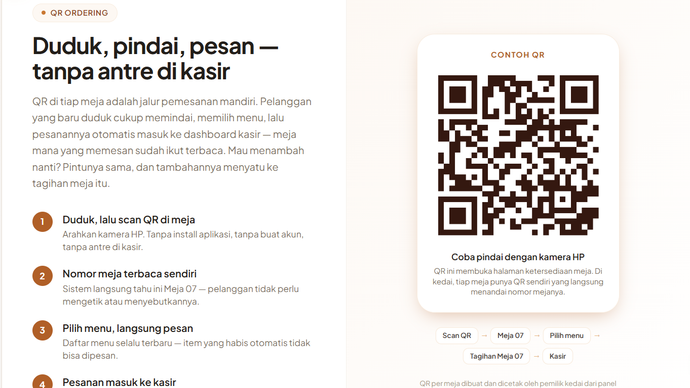
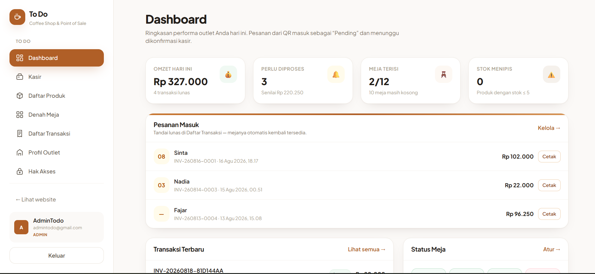
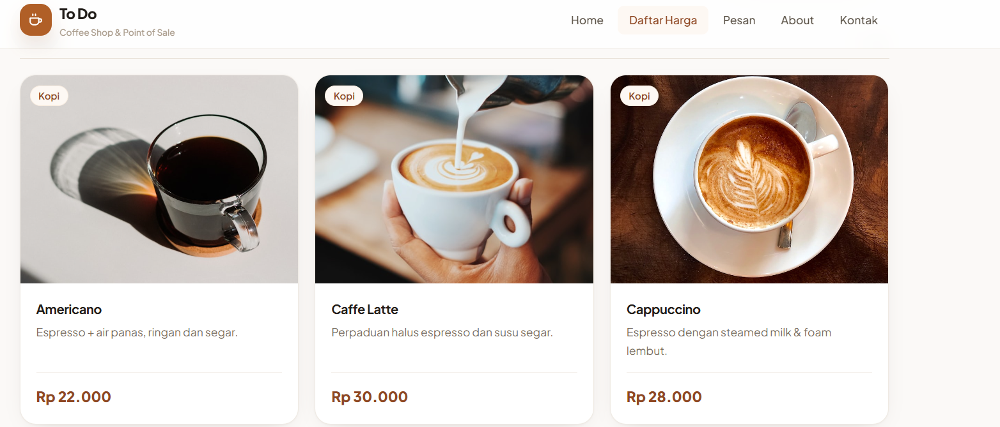
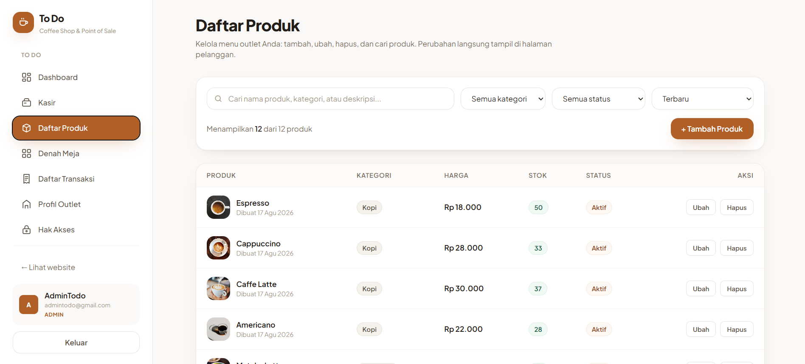
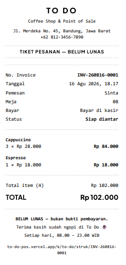
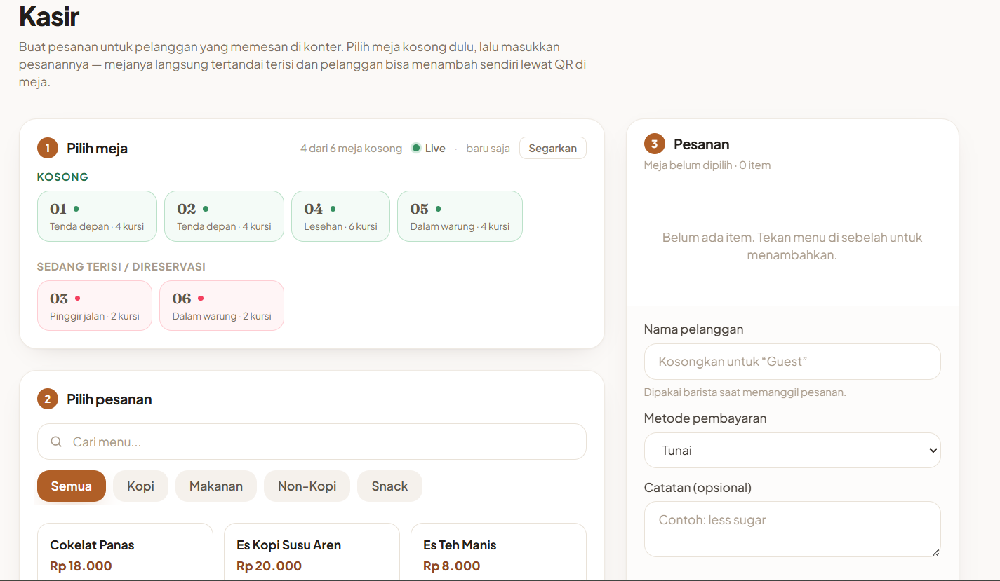
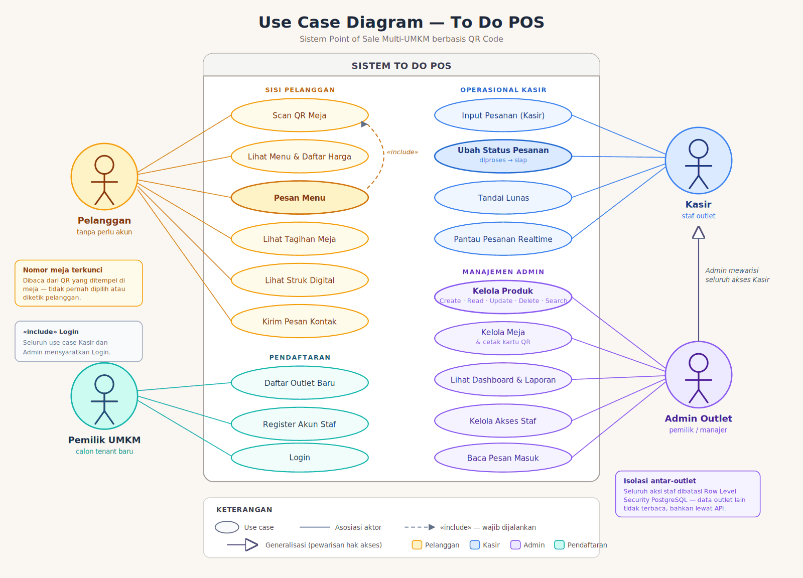
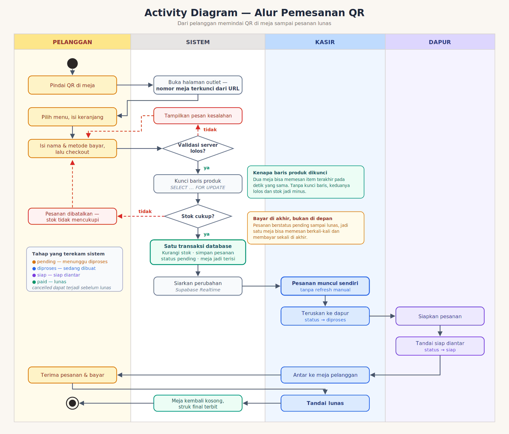
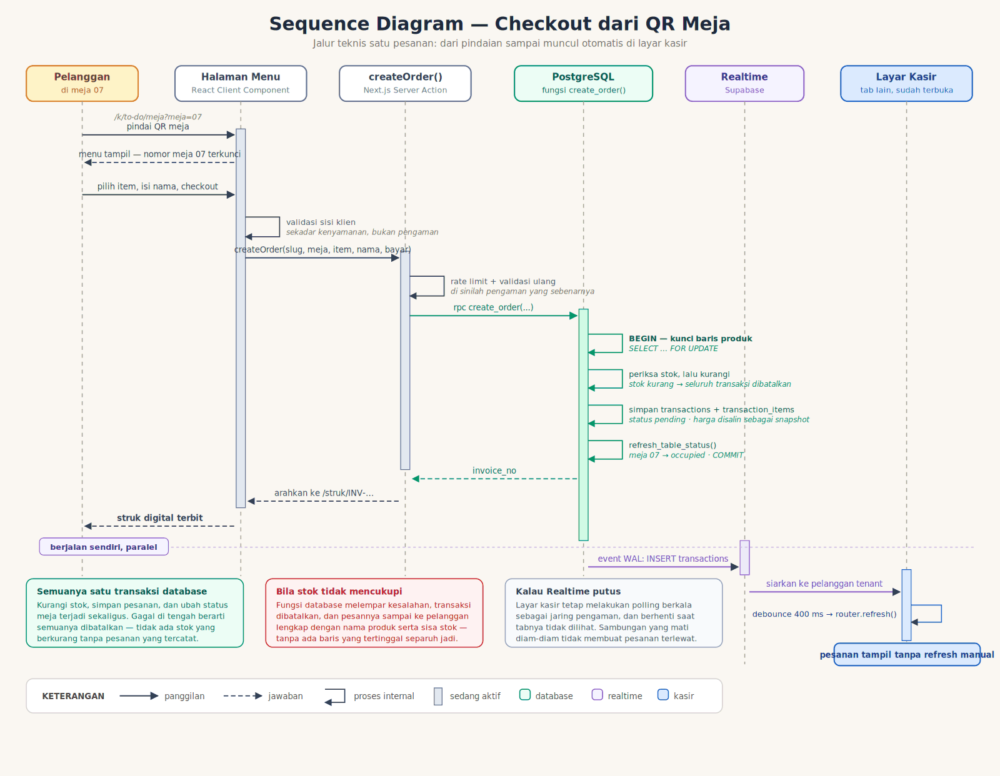
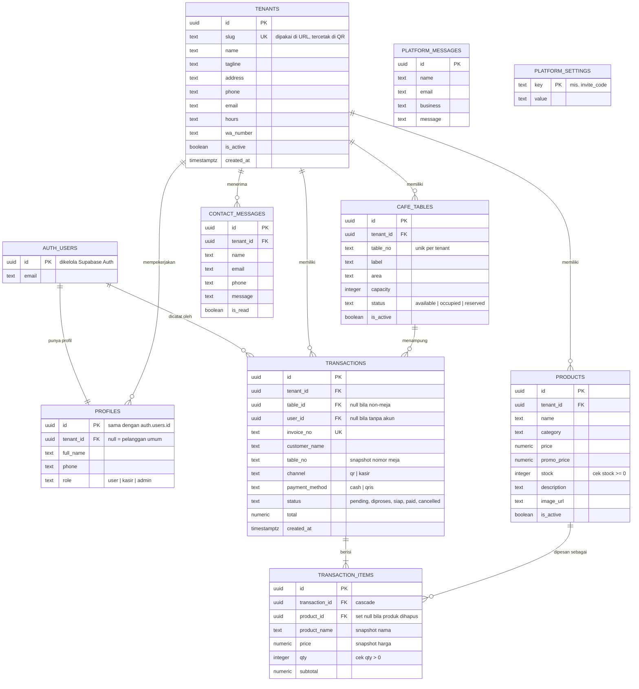

<div align="center">

# ☕ To Do POS

**Pesan dari meja, tanpa antre, tanpa unduh aplikasi, tanpa bikin akun.**

Pindai QR di meja → menu terbuka → pesan → struk terbit.
Satu pemasangan melayani banyak UMKM sekaligus, masing-masing terisolasi sampai level database.

*Dibuat untuk lomba **UMKM Goes Digital***

</div>

---

## 🚀 Coba Sekarang — Tanpa Instalasi

> **Untuk Juri:** seluruh sistem sudah daring. Tidak perlu clone, tidak perlu pasang apa pun.

| Akses | Tautan / Kredensial |
|---|---|
| 🌐 **Situs utama** | [to-do-pos.vercel.app](https://to-do-pos.vercel.app) |
| 📱 **Simulasi Scan QR (Meja 07)** | [Buka halaman meja 07 →](https://to-do-pos.vercel.app/k/to-do/meja?meja=07&demo=1) |
| 🏪 **Outlet kedua** *(bukti isolasi data)* | [Buka Roti Bakar 88 →](https://to-do-pos.vercel.app/k/roti-88) |
| 🔑 **Admin — outlet To Do** | `adminTodo@gmail.com` · `12345678` |
| 💵 **Kasir — outlet To Do** | `kasirTodo@gmail.com` · `12345678` |
| 🔑 **Admin — outlet Roti Bakar 88** | `adminRoti@gmail.com` · `12345678` |

### 🧪 Alur uji 3 menit

Empat langkah ini menunjukkan seluruh nilai sistem. Idealnya langkah 1 dibuka dari HP.

**1️⃣ Jadi pelanggan.** Buka tautan *Simulasi Scan QR* → pesan 2 item → struk digital terbit.
Perhatikan: **nomor meja sudah terisi dan tidak bisa diubah.** Itu bukan keterbatasan, itu fiturnya.

**2️⃣ Jadi kasir.** Login akun kasir → pesanan tadi **sudah muncul sendiri**, tanpa menekan refresh.
Gerakkan melalui tahapannya: `pending → diproses → siap → lunas`. Meja otomatis kosong kembali.

**3️⃣ Jadi admin.** Login akun admin → **Daftar Produk** → tambah produk baru.
Produk langsung tampil di menu pelanggan. Di halaman ini pula seluruh **CRUDS** dapat diuji.

**4️⃣ Uji isolasinya.** Buka outlet kedua. Menu, meja, dan transaksinya berdiri sendiri.
Admin outlet pertama **tidak dapat membaca data ini sama sekali** — bukan karena disaring aplikasi,
melainkan karena ditolak PostgreSQL lewat Row Level Security.

---

## 📸 Tampilan

<table>
<tr>
<td width="50%"><br><sub><b>Pelanggan</b> — setelah memindai QR meja</sub></td>
<td width="50%"><br><sub><b>Admin</b> — dashboard ringkasan</sub></td>
</tr>
<tr>
<td><br><sub><b>Pelanggan</b> — memilih menu &amp; keranjang</sub></td>
<td><br><sub><b>Admin</b> — kelola produk (CRUDS)</sub></td>
</tr>
<tr>
<td><br><sub><b>Pelanggan</b> — struk digital</sub></td>
<td><br><sub><b>Kasir</b> — pesanan masuk otomatis</sub></td>
</tr>
</table>

---

## ✅ Peta Fitur

Ringkasan kemampuan sistem beserta rute untuk mencobanya langsung.

| Kemampuan | Rute | Keterangan |
|---|---|---|
| **Beranda outlet** | `/k/<slug>` | Profil, menu unggulan, jam buka |
| **Pemesanan mandiri** | `/k/<slug>/menu` | Keranjang, checkout, struk digital |
| **Pemesanan lewat QR meja** | `/k/<slug>/meja?meja=07` | Nomor meja terkunci dari QR |
| **Daftar harga** | `/k/<slug>/katalog` | Katalog baca-saja untuk pengunjung |
| **Tagihan berjalan** | `/k/<slug>/bayar` | Pesan berkali-kali, bayar sekali |
| **Kontak** | `/k/<slug>/kontak` | Form pesan masuk ke kotak masuk admin |
| **Tentang usaha** | `/k/<slug>/about` | Cerita dan identitas outlet |
| **Masuk staf** | `/k/<slug>/login` | Tertaut ke pendaftaran akun baru |
| **Pendaftaran akun** | `/k/<slug>/register` | Untuk staf outlet |
| **Dasbor** | `/k/<slug>/admin` | Omzet, transaksi, produk terlaris |
| **Kelola produk** | `/k/<slug>/admin/produk` | Tambah, ubah, hapus, cari, arsipkan |
| **Kelola transaksi** | `/k/<slug>/admin/transaksi` | Riwayat, filter status, pelunasan |
| **Layar kasir** | `/k/<slug>/admin/kasir` | Pesanan di konter dan takeaway |
| **Denah meja & QR** | `/k/<slug>/admin/meja` | Kelola meja, cetak kartu QR |
| **Akses staf** | `/k/<slug>/admin/akses` | Atur peran admin dan kasir |
| **Profil outlet** | `/k/<slug>/admin/profil` | Identitas, jam buka, kontak |
| **Pendaftaran outlet baru** | `/daftar-outlet` | UMKM bergabung secara mandiri |

**Yang menjaga sistem tetap aman dan konsisten:**

- **Validasi berlapis** — di peramban demi kenyamanan, di server sebagai pengaman sesungguhnya, dan batasan di basis data sebagai jaring terakhir
- **Empat lapis kendali akses** — middleware, layout, server action, hingga Row Level Security PostgreSQL
- **Pembatasan laju dan honeypot** pada seluruh form publik
- **Uji otomatis Playwright** pada tampilan desktop dan ponsel

> **Halaman lain yang juga tersedia:** `/katalog` (daftar harga), `/promo`, `/fitur`, `/bayar`,
> `/admin/kasir`, `/admin/meja`, `/admin/akses`, `/admin/profil`, `/daftar-outlet`.

---

## 💡 Yang Membuatnya Berbeda

**🏢 Satu pemasangan, banyak UMKM.**
Tiap outlet punya alamat, menu, denah meja, dan admin sendiri. Isolasinya bukan sekadar
penyaringan di aplikasi, melainkan *Row Level Security* PostgreSQL — admin outlet A tidak dapat
membaca data outlet B meskipun memanggil API secara langsung.

**🚪 UMKM baru bisa bergabung sendiri.**
Lewat `/daftar-outlet` dengan kode undangan. Tanpa developer, tanpa SQL, tanpa deploy ulang.
Inilah yang membuatnya melayani *UMKM* — bukan satu kedai saja.

**🔒 Nomor meja tidak bisa diketik.**
Terbaca dari QR dan terkunci. Ini menghapus kesalahan paling mahal di kedai: pesanan nyasar ke
meja lain. Halaman pemesanan tanpa QR pun tetap menolak menerima nomor meja bebas.

**🧾 Pesan berkali-kali, bayar sekali.**
Tagihan berjalan per meja. Pelanggan menambah pesanan sepanjang duduk; kasir menutup sekali di akhir.

**👨‍🍳 Dapur ikut terekam.**
Status pesanan bertahap: `pending → diproses → siap → paid`. Kasir tahu mana yang sedang dimasak
dan mana yang menunggu diantar — bukan sekadar "sudah bayar atau belum".

**⚡ Layar kasir hidup sendiri.**
Pesanan dari meja muncul tanpa refresh, lewat Supabase Realtime, dengan polling sebagai jaring
pengaman bila sambungan putus diam-diam.

**🧪 Diuji otomatis.**
Playwright E2E pada desktop dan Pixel 7 — termasuk satu berkas uji yang khusus menjaga agar
ketentuan lomba ini tetap terpenuhi: `tests/e2e/kriteria-halaman.spec.js`.

---

## 📊 Diagram Sistem

### Use Case



### Alur Pemesanan (Activity)



### Jalur Teknis Checkout (Sequence)



### Entity Relationship Diagram



**Tiga keputusan desain yang terlihat di ERD:**

1. **`tenant_id` sebagai poros isolasi.** Lima tabel menggantung ke `tenants`. RLS menegakkannya di
   database, bukan di aplikasi.
2. **Snapshot pada `transaction_items`.** Nama dan harga produk disalin saat pemesanan, sehingga
   struk lama tetap benar walau produk berubah harga atau dihapus.
3. **Dua tabel platform tanpa `tenant_id`.** `platform_messages` dan `platform_settings` milik
   platform, bukan outlet — di sanalah kode undangan pendaftaran disimpan.

---

## 🧰 Tech Stack

| Lapisan | Teknologi |
|---|---|
| **Framework** | Next.js 14 (App Router) — Server Component, Server Action, middleware |
| **UI** | React 18 + Tailwind CSS 3.4 — komponen ditulis sendiri, tanpa library komponen seperti MUI/shadcn |
| **Ikon** | lucide-react |
| **Database** | Supabase — PostgreSQL 15 + Row Level Security |
| **Autentikasi** | Supabase Auth (`@supabase/ssr`) |
| **Realtime** | Supabase Realtime (publikasi WAL pada tabel transaksi) |
| **QR Code** | `qrcode` — generator kartu meja siap cetak |
| **Testing** | Playwright E2E — Chrome desktop + Pixel 7 |
| **Bahasa** | JavaScript (JSX) + SQL / PL-pgSQL |
| **Deployment** | Vercel (aplikasi) + Supabase Cloud (database) |

<details>
<summary><h2>📖 Dokumentasi Teknis Lengkap — arsitektur, keamanan, alur, cara menjalankan (klik untuk membuka)</h2></summary>

<br>

## 🏪 Satu pemasangan, banyak UMKM

Sejak **v4**, satu pemasangan sistem ini melayani **banyak outlet sekaligus**. Setiap UMKM
punya `slug` sendiri yang muncul di URL dan ikut tercetak permanen di QR mejanya:

```
/                          landing SISTEM + direktori outlet
/daftar-outlet             pendaftaran UMKM baru
/k/to-do                   beranda To Do (coffee shop)
/k/to-do/meja?meja=07      hasil scan QR meja 07 To Do
/k/to-do/admin             dashboard To Do

/k/roti-88/meja?meja=03    outlet lain, denah & menu sendiri
```

**Dua halaman depan untuk dua pembaca.** Sejak v6 landing sistem dan halaman kedai
dipisah tegas — lihat [Siapa bicara kepada siapa](#-siapa-bicara-kepada-siapa).

Pemisahannya **bukan sekadar penyaring di kueri aplikasi.** Seluruh RLS policy ikut
disaring per outlet (`is_admin_of()` / `is_staff_of()`), nomor meja unik **per outlet**,
dan ketiga RPC publik menerima slug — jadi admin To Do tidak bisa membaca apalagi
mengubah data Roti Bakar 88, sekalipun ia menebak id barisnya.

**`supabase/schema.sql` menyemai DUA outlet, bukan satu.** Itu bukan contoh data yang
berlebihan: selama tabel `tenants` cuma berisi satu baris, direktori di `/` menampilkan
satu kartu dan seluruh sistem *terlihat* seperti aplikasi satu kedai — mesinnya jalan
penuh tapi tidak ada yang bisa dilihat. Outlet kedua sengaja bukan coffee shop:

| Outlet | Alamat | Isi |
| --- | --- | --- |
| **To Do** | `/k/to-do` | Coffee shop · 12 produk · 12 meja (Indoor & Outdoor) |
| **Roti Bakar 88** | `/k/roti-88` | Warung roti bakar buka sampai dini hari · 10 produk · 6 meja, **mulai dari Meja 01 lagi** |

Meja 01 yang ada di kedua outlet itu sendiri sebuah bukti: sampai v3 nomor meja unik
secara global. Constraint-nya kini `(tenant_id, table_no)`.

---

## 🎭 Siapa bicara kepada siapa

Sampai v5 hanya ada satu landing page, dan ia melayani dua orang sekaligus. Halaman
outlet memuat Portfolio mitra, Testimoni pemilik kedai lain, daftar Layanan POS,
Keunggulan teknis, dan FAQ tentang Row Level Security — sementara halaman About-nya
berjudul *"Secangkir kopi yang berujung jadi sebuah sistem"* dan Kontak-nya menawarkan
*"konsultasi pertama gratis"*.

Semua teks itu ditulis tetap di dalam kode, jadi **setiap outlet menampilkan cerita yang
sama persis**: warung roti bakar yang mendaftar kemarin ikut mengaku punya Engineering
Lead, 38 outlet mitra, dan pengalaman tujuh tahun membangun perangkat lunak. Dan
pelanggan yang baru memindai QR di mejanya — yang cuma ingin tahu harga roti bakar —
harus melewati materi jualan sebuah software house sebelum sampai ke menu.

**v6 memisahkan keduanya.**

| | Landing platform `/` | Halaman outlet `/k/<slug>` |
| --- | --- | --- |
| **Pembaca** | Pemilik usaha yang sedang menimbang | Pelanggan yang sedang duduk di kedai |
| **Isi** | Fitur · Cara Kerja · Keunggulan · Portfolio · Testimoni · Direktori Outlet · FAQ · **Kontak** | Beranda · Menu · Pesan · About · Kontak |
| **Navbar** | Fitur · Cara Kerja · Keunggulan · Outlet · FAQ · Kontak + **Daftarkan UMKM** | Home · Menu · Pesan · About · Kontak |
| **Kotak masuk** | `platform_messages` — pertanyaan soal sistemnya | `contact_messages` — kritik & saran untuk kedai itu |
| **Footer** | Tautan platform + daftar outlet. **Tanpa** pintu staf | Info kedai + **Masuk Staf** |
| **Sumber teks** | Ditulis tetap — memang cuma ada satu platform | Kolom di tabel `tenants`, disunting pemiliknya |

Lima halaman outlet, dan **“Meja” bukan salah satunya**. Denah meja tetap hidup di
`/meja` — ia tujuan tombol *Pesan Sekarang*, jalan keluar kartu “Meja belum diketahui”
di `/menu`, dan tautan “Duduk di meja lain?” pada layar hasil pindai. Yang dicabut hanya
tempatnya di navbar: memilih meja bukan halaman yang orang tuju melainkan satu langkah
di tengah memesan, dan yang memindai QR sudah melewatinya tanpa sadar.

Batas ini dijaga [`tests/e2e/pemisahan-platform.spec.js`](tests/e2e/pemisahan-platform.spec.js)
dari kedua arah — section yang hilang dari platform sama merugikannya dengan section yang
merembes kembali ke outlet.

### Halaman outlet kini bercerita tentang dirinya sendiri

| Halaman | Isinya sekarang | Datanya dari |
| --- | --- | --- |
| **Home** | Nama & tagline kedai, jam buka, alamat, tombol WhatsApp · menu favorit · cerita ringkas · cara pesan lewat QR | `tenants` + 4 produk teratas |
| **Menu** `/katalog` | Daftar produk baca-saja beserta harga & promo | `products` |
| **Pesan** `/menu` | Pilih produk, isi keranjang, checkout | `products` + `create_order` |
| **About** | Cerita panjang kedai, informasi praktis, akun sosial media | `tenants.story` dkk. |
| **Kontak** | Formulir kritik & saran, kanal kontak, sosial media | `tenants` + `contact_messages` |

Kolom `tenants.story` diisi pemilik outlet lewat **`/admin/profil`** — halaman admin baru
di v6. Tanpa itu, setiap UMKM yang mendaftar lewat `/daftar-outlet` akan punya About
kosong selamanya, sebab satu-satunya cara mengisinya adalah `update` manual di SQL Editor.
Outlet yang belum menulis ceritanya tidak menampilkan halaman rusak: About-nya tetap
memuat jam buka, alamat, dan kontak, plus satu kalimat jujur bahwa ceritanya belum ditulis.

### Dua kotak masuk, dan sengaja tidak disatukan

Formulir kontak ada di dua tempat, tapi yang mengisinya orang yang berbeda — dan
karena itu tabelnya juga berbeda:

| | Landing `/` (bagian Kontak) | Outlet `/k/<slug>/kontak` |
| --- | --- | --- |
| **Pengirim** | Calon mitra yang belum punya outlet | Pelanggan sebuah kedai |
| **Isi** | "Warung saya cuma 4 meja, masuk akal pakai QR?" | "Pesanan saya keliru", "tolong tambah menu X" |
| **Tabel** | `platform_messages` | `contact_messages` |
| **Dibaca** | SQL Editor (belum ada dashboard platform) | Admin outlet tujuan, lewat RLS |

Menyatukan keduanya terdengar rapi sampai dilihat kolomnya: setiap baris
`contact_messages` **wajib** menempel pada satu outlet, sebab yang berhak
membacanya adalah admin outlet itu. Pertanyaan orang yang belum punya outlet
tidak punya `tenant_id` yang benar — menitipkannya ke sana berarti memilih satu
outlet secara sembarang lalu membocorkan pesan itu, beserta email dan nomor
telepon pengirimnya, ke admin yang tidak ada urusannya.

`platform_messages` ber-RLS dengan **satu policy saja, `insert`**. Tidak ada
policy baca, dan itu bukan yang terlupa: belum ada peran "pemilik platform" di
sistem ini, jadi tidak ada siapa pun yang bisa disebut di dalam `using (...)`.
Menulis policy baca yang longgar demi kelengkapan justru membuka isi kotak
masuknya kepada siapa pun yang memegang anon key.

```sql
-- Membaca pertanyaan yang masuk, sampai dashboard platform ada:
select created_at, name, email, phone, business, message
from public.platform_messages order by created_at desc;
```

Kanal cepatnya tetap WhatsApp — nomornya dari `NEXT_PUBLIC_WA_NUMBER`, variabel
yang sudah lama ada di `.env.local` tapi tidak pernah dibaca satu berkas pun
sejak identitas kedai pindah ke tabel `tenants` di v4.

> **Slug tetap terkunci di `/admin/profil`.** Ia tercetak permanen di QR tiap meja, jadi
> kolomnya sengaja tidak disediakan — dan trigger `tenants_slug_immutable` menolaknya di
> database sekalipun ada yang mengirimnya lewat jalan lain.

---

## 🆕 Menambah UMKM baru

Ada dua jalan, dan yang pertama tidak menyentuh database sama sekali.

### A. Lewat halaman pendaftaran *(cara biasanya)*

```
/daftar-outlet             isi nama usaha → slug terisi sendiri → kode undangan
      ↓                    create_tenant() — outlet jadi, langsung muncul di /
/k/<slug>/register         akun PERTAMA outlet ini otomatis jadi adminnya
      ↓
/k/<slug>/admin/produk     isi menunya
/k/<slug>/admin/meja       buat denah meja + unduh kartu QR siap cetak
```

Sampai v4, menambah UMKM berarti membuka SQL Editor dan menempelkan satu `insert`.
Masalahnya bukan kerumitan SQL-nya, melainkan siapa yang mampu menjalankannya: sistem
yang mengaku melayani banyak UMKM tapi menuntut akses database untuk menerima UMKM
berikutnya belum benar-benar melayani banyak UMKM.

**Pendaftarannya dijaga kode undangan**, dan kodenya disimpan di tabel
`platform_settings` — **bukan** di `.env`. Alasannya bukan selera: `create_tenant()`
adalah fungsi `SECURITY DEFINER` yang terbuka lewat PostgREST, jadi siapa pun yang
memegang anon key — dan anon key memang publik, ia ikut terkirim ke browser — bisa
memanggilnya langsung tanpa pernah menyentuh formulirnya. Kode yang hanya diperiksa di
Server Action akan terlewati oleh panggilan seperti itu. Pemeriksaannya karena itu
duduk di dalam fungsinya, di tempat yang tidak bisa dilangkahi.

Tabelnya sendiri ber-RLS **tanpa satu pun policy** — di PostgreSQL itu berarti tertutup
rapat untuk semua pembaca lewat API, termasuk admin outlet. Yang tetap bisa
mencocokkannya hanyalah fungsi `SECURITY DEFINER` tadi.

```sql
-- Kode bawaan: UMKM-2026. GANTI sebelum dipakai sungguhan.
update public.platform_settings set value = 'kode-rahasiamu', updated_at = now()
where key = 'invite_code';
```

**Akun pertama sebuah outlet lahir sebagai admin** — dan hanya yang pertama. Tanpa
aturan itu outlet baru terkunci sejak lahir: seluruh area admin butuh role `admin`, tapi
satu-satunya cara menaikkan role adalah halaman `/admin/akses` yang butuh admin.
Konsekuensinya jujur disebut di sini: ada jeda antara outlet dibuat dan akun pertamanya
mendaftar, dan siapa pun yang mendaftar lebih dulu di jeda itu yang jadi adminnya —
karena itulah pembuatan outletnya dijaga kode undangan, dan register sebaiknya langsung
dilakukan sesudahnya.

**Outlet baru lahir kosong** — tanpa produk, tanpa meja. Menyalin menu contoh ke dalamnya
akan membuat setiap outlet baru mengaku menjual Espresso dan Nasi Goreng Kampung, dan
pemiliknya menghabiskan menit-menit pertamanya menghapus barang dagangan yang bukan
miliknya.

### B. Lewat SQL Editor *(pemulihan & pemindahan akun)*

Tetap ada dan tetap didukung — lihat [bagian 11 di `supabase/schema.sql`](supabase/schema.sql).
Dipakai saat memulihkan outlet yang adminnya hilang, memindahkan akun antar-outlet, atau
menonaktifkan outlet. Tiga hal yang memang tidak diberi tombol.

> **Slug itu permanen.** Ia ikut tercetak ke dalam QR setiap meja. Menggantinya setelah
> kartu meja dicetak = mencetak ulang semuanya. Peringatan ini menempel pada kolomnya di
> formulir, bukan disimpan di syarat & ketentuan.
>
> **Menonaktifkan outlet jangan pakai `delete`.** Seluruh FK-nya `on delete cascade` —
> menghapus satu baris `tenants` ikut menghapus produk, meja, dan seluruh riwayat
> transaksinya. Pakai `update public.tenants set is_active = false`.

---

## 🧰 Tech Stack

| Lapisan | Teknologi | Versi | Peran |
| --- | --- | --- | --- |
| **Framework** | [Next.js](https://nextjs.org) (App Router) | 14.2 | Routing, Server Component, Server Action, middleware |
| **UI Library** | [React](https://react.dev) | 18.3 | Komponen antarmuka |
| **Styling** | [Tailwind CSS](https://tailwindcss.com) | 3.4 | Design system (palet, tipografi, utilitas) |
| **PostCSS** | Autoprefixer | 10.4 | Prefix vendor otomatis |
| **Database** | [Supabase](https://supabase.com) — PostgreSQL | 15 | Tabel, trigger, fungsi RPC (PL/pgSQL) |
| **Auth** | Supabase Auth (`@supabase/ssr` 0.5) | — | Login/register email-password, sesi berbasis cookie |
| **Keamanan data** | PostgreSQL Row Level Security | — | Policy per tabel + fungsi `SECURITY DEFINER` |
| **QR Code** | [`qrcode`](https://www.npmjs.com/package/qrcode) | 1.5 | Generator QR per nomor meja (PNG) |
| **Font** | Plus Jakarta Sans · Fraunces | — | Dimuat via Google Fonts, fallback ke font sistem |
| **Bahasa** | JavaScript (JSX) + SQL (PL/pgSQL) | ES2022 | — |
| **Lint** | ESLint + `eslint-config-next` | 8.57 / 14.2 | `no-undef` & aturan React/Next — ikut jalan saat `npm run build` |
| **Runtime** | Node.js | ≥ 18 (diuji di 22) | — |

Tanpa dependensi UI pihak ketiga — seluruh komponen (Button, Modal, Badge, Field, Toast,
Table, Card, dsb.) ditulis sendiri di `src/components/ui/`.

---

## ✨ Fitur

| Area | Isi |
| --- | --- |
| **Landing sistem** `/` | Navbar platform · Hero · Layanan Utama · Cara Kerja · Keunggulan · Portfolio · Testimoni · **Direktori Outlet** · FAQ · **Kontak (formulir + WhatsApp)** · CTA Daftarkan UMKM · Footer platform |
| **Pendaftaran** | `/daftar-outlet` — UMKM baru mendaftar sendiri, dijaga kode undangan; outlet langsung hidup tanpa deploy ulang |
| **Beranda outlet** `/k/<slug>` | Navbar kedai · Hero (nama, jam buka, alamat, WhatsApp) · Menu Favorit · Cerita ringkas · QR Pemesanan · CTA WhatsApp · Footer kedai |
| **Pelanggan (tanpa login)** | `/meja?meja=07` layar hub hasil scan QR · `/katalog` daftar menu baca-saja (ikut membawa `?meja=` supaya ajakan pesannya kembali ke meja yang sama) · `/meja` ketersediaan meja real-time · `/menu` pilih & pesan · `/bayar` tagihan berjalan per meja · `/promo` menu diskon hari ini · `/struk/[invoice]` bukti pesanan · `/kontak` kritik & saran + sosial media · `/about` cerita kedai |
| **Auth** | Login & Register (Supabase Auth) — **khusus staf**, role `user` / `kasir` / `admin`. `/login` dijangkau lewat tautan **Masuk Staf** di baris paling bawah footer outlet; `/register` tetap hanya lewat URL langsung |
| **Admin** | Dashboard (omzet, pesanan pending, status meja, stok menipis) · **Kasir** (buat pesanan untuk pelanggan walk-in) · Daftar Produk (CRUD + Search) · Denah Meja (CRUD + status + generator QR) · Daftar Transaksi · **Profil Outlet** · **Hak Akses** |
| **QR Ordering** | Beranda outlet menjelaskan alurnya + satu QR contoh. **Generator kartu meja (unduh PNG siap cetak: nomor meja besar + QR + instruksi) ada di `/admin/meja`** — alat operasional pemilik kedai, bukan fitur publik |

---

## 🧭 Alur pemesanan

**QR di tiap meja adalah jalur pemesanan mandiri.** Pelanggan mencari tempat, duduk, lalu
memesan dari mejanya sendiri — kasir bukan pintu masuk, melainkan tempat membayar di akhir.
Pemesanan tambahan memakai pintu yang sama persis: pindai lagi, dan tambahannya menempel ke
tagihan meja itu.

```
QR  →  Table ID = 07  →  Pilih menu  →  Sistem  →  Order  →  Meja 07  →  Kasir
```

Nomor meja terbaca dari QR-nya sendiri, jadi pelanggan tidak pernah mengetik atau menyebutkan
nomor meja, dan kasir tidak pernah salah menempelkan pesanan ke meja yang keliru.

Ada **dua jalan masuk**, dan keduanya berakhir di tagihan meja yang sama.

### A. Dilayani kasir (walk-up / pelanggan yang minta dibantu)

```
Pelanggan datang  →  /admin/kasir      Kasir: pilih MEJA KOSONG → masukkan pesanan
                  →  duduk di mejanya  Meja otomatis tertandai "Terisi"
                  →  scan QR di meja   Mau nambah? Pesan sendiri, tanpa antre lagi
                  →  /admin/transaksi  Kasir menandai "Lunas" saat pelanggan pulang
```

Pesanan dari kasir sengaja dibuat berstatus **`pending`**, bukan langsung lunas. Alasannya:
status meja diturunkan dari ada-tidaknya pesanan pending, jadi pesanan yang langsung dilunasi
akan membuat mejanya kembali “Tersedia” padahal pelanggan baru saja duduk di situ. Semua
tambahan lewat QR menempel ke meja yang sama dan dilunasi sekali di akhir.

### B. Duduk → scan QR di meja → pesan sendiri *(jalur utama)*

```
QR di meja  →  /meja?meja=07&src=qr  POPUP langsung muncul, dua pilihan:
                                      Langsung Pesan  → /menu?meja=07&src=qr
                                      Tambah Pesanan  → /menu?meja=07&src=qr&mode=tambah
                                      (urutannya dibalik bila meja sudah punya tagihan)
                                    Popup ditutup → LAYAR HUB di belakangnya:
                                      📖 Lihat Menu → /katalog?meja=07 menu & harga (baca saja)
                                      🛒 Pesan      → /menu?meja=07&src=qr pesan dari meja ini
                                      💳 Bayar   → /bayar?meja=07 tagihan berjalan meja ini
                                      🔥 Promo   → /promo?meja=07 menu yang sedang diskon
            →  /menu?meja=07&src=qr Pilih menu, isi nama, checkout
            →  /struk/INV-…?src=qr  Bukti pesanan digital
            →  /admin/transaksi     Kasir menandai "Lunas" → meja otomatis kosong lagi
```

Mana yang jadi tombol utama di popup ditentukan keadaan meja, bukan tebakan. Meja yang masih
bersih — pelanggan yang baru duduk — menonjolkan **Langsung Pesan**. Begitu meja itu punya
tagihan berjalan, judulnya berganti jadi **“Mau nambah pesanan?”** dan **Tambah Pesanan** yang
naik ke atas beserta jumlah dan totalnya. Satu QR melayani dua keadaan tanpa pelanggan perlu
memilih mana yang berlaku untuknya.

Cabang `mode=tambah` bukan sekadar beda kata: halaman menu berganti judul jadi “Tambah pesanan
untuk Meja 07” dan memunculkan tagihan yang sedang berjalan, supaya jelas tambahannya menempel
ke situ — bukan jadi tagihan terpisah. Apa pun cabangnya, **pembayaran tetap sekali di akhir**.

Yang memindai QR meja 07 memang sedang duduk di meja 07, jadi ia tidak disuruh memilih meja
lagi. Grid ketersediaan meja tetap ada di **`/meja` tanpa parameter** (dari navbar, atau lewat
tautan “Duduk di meja lain?” di bawah hub).

**Penanda `src=qr`.** Meja bisa sampai ke `/menu` lewat dua jalan yang berbeda maknanya:
dipilih sendiri dari denah, atau ditentukan tempat duduk lalu terbaca dari QR. Hanya jalan
pertama yang layak disebut “Pilih meja” di stepper; bagi pemindai QR, langkah itu tidak pernah
ada — menandainya selesai membuat alurnya terasa mengada-ada dan tautan mundurnya menawarkan
pekerjaan fiktif. Penanda ini dipasang oleh `ScanHub`/`ScanIntentDialog`, **bukan dibaca dari
URL yang masuk**, sehingga QR lama yang terlanjur tercetak tanpa `src` tetap ikut benar: sampai
di layar hub itu sendiri sudah berarti habis memindai. Penanda dibawa terus sampai `/struk`
supaya asal-usulnya tidak putus di langkah terakhir.

Pesanan yang masuk lewat QR berstatus **`pending`** dan menandai mejanya **terisi**.
Begitu kasir menandainya **lunas** (atau **batal**), trigger database membebaskan meja itu kembali.
Selama masih `pending`, pesanan itulah yang muncul di halaman **Bayar** meja tersebut.

---

## 🔄 Layar admin memperbarui dirinya sendiri

Jalur B punya konsekuensi yang tidak kelihatan sampai kedainya ramai: **pesanan
masuk tanpa ada yang menyentuh layar admin.** Pelanggan memindai QR di mejanya
sendiri, barisnya sudah ada di `transactions` — tapi `/admin/transaksi` masih
menampilkan hasil render terakhir, dan `/admin/kasir` masih menawarkan meja yang
baru saja terisi. Sampai v6 satu-satunya obatnya adalah kasir yang ingat menekan
F5, dan yang lupa baru tahu saat pelanggan datang menagih.

Dua layar itu kini menyegarkan dirinya lewat [`useLiveRefresh()`](src/lib/useLiveRefresh.js):

| Layar | Yang diawasi | Ditahan saat |
| --- | --- | --- |
| `/admin/transaksi` | `transactions` | Modal detail / konfirmasi hapus terbuka |
| `/admin/kasir` | `cafe_tables`, `products` | Pesanan sedang dikirim |

Halaman pelanggan ikut memperbarui dirinya lewat hook yang sama, tapi **tanpa
Realtime** — alasannya bukan kelalaian, lihat [Sisi pelanggan ikut
hidup](#sisi-pelanggan-ikut-hidup--tapi-tanpa-realtime-dan-itu-disengaja).

**Dua pemicu, dan polling sengaja tidak dimatikan.** Supabase Realtime jadi jalur
utama — perubahan didorong server, sampai dalam hitungan detik. Di belakangnya
`router.refresh()` tetap berjalan tiap **10 detik**, turun jadi **60 detik** begitu
Realtime tersambung. Mematikannya sama sekali berarti menaruh seluruh kepercayaan
pada satu WebSocket yang bisa mati diam-diam tanpa memberi status error — persis
jenis kegagalan yang sedang diperbaiki bagian ini.

Polling berhenti saat tab-nya tersembunyi dan **menyegarkan sekali begitu tab itu
kembali dilihat**, jadi tab kasir yang ditinggal di belakang tidak menanyai
database tiap 10 detik, tapi juga tidak pernah menampilkan data basi saat dibuka lagi.

**Yang ditahan tidak dibuang.** Selagi modal terbuka, perubahan yang datang
dicatat lalu dijalankan begitu modal ditutup — menarik data baru di bawah mata
orang yang sedang membaca detail transaksi sama merugikannya dengan tidak
menariknya sama sekali.

Di layar kasir justru sebaliknya: pembaruan **tidak** ditahan walau keranjangnya
sudah terisi. Saat itulah kasir paling perlu tahu mejanya keburu diambil pesanan
QR, dan seluruh isi keranjang tersimpan di state komponen — `router.refresh()`
tidak menyentuhnya.

### Penanda kecil di pojok, dan kenapa ia perlu ada

Layar yang berhenti butuh F5 menghilangkan satu-satunya cara kasir tahu apakah
yang dilihatnya masih benar: **“tidak ada pesanan baru” dan “layarnya membeku”
terlihat persis sama.** Karena itu keduanya memasang
[`LiveIndicator`](src/components/admin/LiveIndicator.jsx) — titik status
(hijau berdenyut = Realtime, kuning = polling saja) plus umur data yang berjalan.
Angka yang terus bertambah tanpa pernah kembali ke nol berarti pembaruannya yang
mati, bukan kedainya yang sepi. Tombol **Segarkan** tetap ada untuk yang tidak
mau menunggu.

### Sisi pelanggan ikut hidup — tapi tanpa Realtime, dan itu disengaja

Pelanggan memegang HP-nya sambil menunggu kasir menandai lunas. Sampai v6 satu-satunya
cara ia tahu statusnya berubah adalah menarik layar untuk memuat ulang — dan yang tidak
terpikir melakukannya menatap **"Menunggu pembayaran"** pada pesanan yang sudah lunas
beberapa menit lalu.

| Halaman | Yang diperbarui | Berhenti saat |
| --- | --- | --- |
| `/k/<slug>/struk/<invoice>` | Status pesanan: pending → lunas / batal | Status bukan `pending` lagi |
| `/k/<slug>/bayar?meja=07` | Tagihan berjalan meja itu | Tidak ada lagi pesanan berjalan |

**Di sini Supabase Realtime tidak dipakai, dan bukan karena terlewat.** Tabel
`transactions` memang tertutup untuk tamu — policy bacanya menuntut
`is_staff_of(tenant_id) or user_id = auth.uid()`, dan itulah sebabnya kedua halaman ini
mengambil datanya lewat RPC `SECURITY DEFINER` (`get_receipt`, `get_table_bill`), bukan
dari tabelnya langsung.

Realtime **mengevaluasi RLS untuk siapa pun yang berlangganan.** Pelanggan anonim tidak
punya izin baca atas `transactions`, jadi langganan `postgres_changes` di halaman ini
tidak akan pernah menerima satu event pun. Menyalakannya menuntut policy baca yang
longgar — dan itu berarti setiap tamu yang membuka halaman struk bisa membaca pesanan
seluruh tamu lain di kedai itu, lengkap dengan nama pemesannya. Layar yang lebih cepat
satu-dua detik tidak sebanding dengan itu.

Jadi polling di sisi pelanggan **bukan versi murahan dari Realtime, melainkan satu-satunya
bentuk yang benar.** `router.refresh()` menempuh jalur yang sama dengan kunjungan biasa:
lewat RPC, yang hanya memulangkan satu invoice atau tagihan satu meja.

[`LiveOrderStatus`](src/components/pos/LiveOrderStatus.jsx) juga **berhenti sendiri**
begitu tidak ada lagi yang ditunggu. Struk lunas yang tertinggal terbuka di HP tidak perlu
menanyai server seumur hidup baterainya — itulah gunanya opsi `enabled` pada hook, yang
berbeda dari `paused`: yang tertahan karena `paused` akan dijalankan begitu jedanya
dibuka, sedangkan yang `enabled: false` memang tidak akan pernah berjalan.

### Menyalakan Realtime di database

Bagian **9b** di `supabase/schema.sql` yang mengurusnya — menambahkan
`transactions`, `cafe_tables`, dan `products` ke publikasi `supabase_realtime`.
Kalau schema versi terbaru belum dijalankan, sistem **tetap berfungsi**: langganan
gagal, penandanya tinggal kuning, dan polling 10 detik yang mengambil alih.

Ketiganya juga diset `replica identity full`. Harganya nyata — WAL jadi lebih
gemuk karena isi baris lama ikut dikirim di tiap update/delete — tapi tanpa itu
event DELETE hanya membawa primary key, sehingga filter `tenant_id` di klien
tidak punya kolom yang dicocokkan dan Realtime tidak bisa mengevaluasi RLS untuk
menentukan siapa yang boleh menerimanya. Pada volume sebuah kedai, WAL yang lebih
besar bukan biaya yang terasa.

Realtime **menghormati RLS**. Policy baca `transactions` menuntut `is_staff_of()`,
jadi menyalakan publikasi ini tidak mengirim riwayat penjualan ke pelanggan
anonim yang kebetulan sedang membuka halaman menu.

---

## 🔒 Isolasi sisi pelanggan ↔ admin

Antarmuka publik **murni melayani pemesanan**. Tidak ada satu pun tautan, tombol, atau
identitas akun yang mengarah ke area staf — bahkan ketika yang membuka situs adalah admin
yang sedang login.

| Dulu ada di sisi publik | Sekarang |
| --- | --- |
| Navbar: tautan **Dashboard** (untuk admin) | Dihapus |
| Navbar: tautan **Login staf** | Dihapus |
| Navbar: chip identitas akun + tombol **Keluar** | Dihapus |
| Footer: kolom **Staf & Admin** (`/login`, `/register`, `/admin`) | Dihapus — disisakan **satu** tautan `Masuk Staf` → `/login` di baris paling bawah |
| Menu Favorit: “tambahkan produk dari Dashboard Admin” | Diganti kalimat netral untuk pelanggan |
| Section QR: pilih meja mana pun → **unduh QR-nya** | Generator pindah ke `/admin/meja`; landing tinggal penjelasan + 1 QR contoh |

**Pintu masuk staf: tautan `Masuk Staf` di baris paling bawah footer.** Satu tautan, ke
`/login` saja, dan sengaja hanya di sana.

Menghapusnya sama sekali — seperti sebelumnya — memindahkan cara masuk ke luar produk:
kasir baru di hari pertamanya harus diberi tahu lisan untuk mengetik `/login`. Sebaliknya,
menaruhnya di navbar bersebelahan dengan **Pesan Sekarang** adalah cara paling cepat
membuat pelanggan yang baru memindai QR mengira ia harus punya akun dulu — padahal seluruh
alur pemesanan justru dibangun supaya ia tidak perlu. Footer bagian bawah menyelesaikan
keduanya: staf tahu tempat mencarinya, pelanggan yang sedang memesan tidak pernah
menggulung sejauh itu.

`/register` tetap tidak ditautkan dari mana pun — penambahan staf berikutnya memang
lewat `/admin/akses`, bukan pendaftaran mandiri. Keduanya tetap publik dan berfungsi
normal: tidak ada rahasia yang bergantung pada URL-nya, seluruh proteksi tetap dijaga
4 lapis (lihat [Keamanan](#-keamanan)).

**Kendali sesi pindah ke `/login`.** Karena sisi publik tidak lagi punya tombol Keluar,
`/login` berperan ganda: saat belum ada sesi ia menampilkan form login, saat sesi aktif ia
menampilkan panel sesi — siapa yang masuk, role-nya, tombol masuk area staf, dan tombol
**Keluar**. Tanpa panel ini akun ber-role `user` akan terkunci: tidak bisa membuka `/admin`,
tidak bisa keluar dari mana pun.

**Tujuan sesudah masuk ditentukan role, bukan satu alamat untuk semua.** Admin mendarat di
Dashboard (`/admin`), kasir langsung di layar kasir (`/admin/kasir`). Alasannya sederhana:
yang dikerjakan kasir sepanjang shift adalah memasukkan pesanan, sedangkan dashboard berisi
angka ringkasan yang gunanya bagi pemilik — mengantar kasir ke sana berarti menyuruhnya
menekan satu menu lagi, setiap kali, seumur pemakaian. Pemetaannya ada di satu tempat,
`STAFF_HOME` di [`src/lib/access.js`](src/lib/access.js), dan dipakai bersama oleh form
login maupun panel sesi (yang tombolnya ikut berganti jadi **Buka Layar Kasir**) — supaya
keduanya tidak bisa berbeda pendapat soal ke mana seorang kasir seharusnya pergi. Staf yang
tiba lewat `?next=` tetap diantar ke halaman yang tadi ia coba buka.

`SiteLayout` juga tidak lagi memanggil `getSessionUser()` — tidak ada elemen publik yang
berubah karena status login, jadi query sesi per request itu murni beban tanpa guna.

> **Catatan untuk penguji/juri:** halaman **Login** dan **Register** tetap ada dan tetap
> memenuhi ketentuan lomba. **Login** dijangkau lewat tautan **Masuk Staf** di baris paling
> bawah footer (atau buka `/login` langsung); **Register** hanya lewat URL langsung
> `/register` — tidak ditautkan, semata-mata karena isolasi ini.

---

## 🔑 Matriks Hak Akses

Halaman **`/admin/akses`** menampilkan tabel ini secara langsung **beserta ID (UUID) tiap akun**
dan tombol untuk menaikkan/menurunkan role.

| Halaman / Aksi | Tamu | User | Kasir | Admin |
| --- | :---: | :---: | :---: | :---: |
| Landing `/`, About, Kontak | ✅ | ✅ | ✅ | ✅ |
| Landing sistem `/` & pendaftaran `/daftar-outlet` | ✅ | ✅ | ✅ | ✅ |
| Membuat outlet baru (`create_tenant`) | 🔑 | 🔑 | 🔑 | 🔑 |
| Katalog menu `/katalog` (baca saja) | ✅ | ✅ | ✅ | ✅ |
| Promo hari ini `/promo` | ✅ | ✅ | ✅ | ✅ |
| Tagihan meja `/bayar?meja=07` | ✅ | ✅ | ✅ | ✅ |
| Ketersediaan meja `/meja` | ✅ | ✅ | ✅ | ✅ |
| Menu & pesan `/menu` | ✅ | ✅ | ✅ | ✅ |
| Struk `/struk/[invoice]` | ✅ | ✅ | ✅ | ✅ |
| Membuat pesanan (checkout) | ✅ | ✅ | ✅ | ✅ |
| Mengirim pesan kontak | ✅ | ✅ | ✅ | ✅ |
| Dashboard `/admin` | ❌ | ❌ | ✅ | ✅ |
| Kasir `/admin/kasir` | ❌ | ❌ | ✅ | ✅ |
| Daftar transaksi `/admin/transaksi` | ❌ | ❌ | ✅ | ✅ |
| CRUD produk `/admin/produk` | ❌ | ❌ | ❌ | ✅ |
| Denah meja `/admin/meja` | ❌ | ❌ | ❌ | ✅ |
| Profil outlet `/admin/profil` | ❌ | ❌ | ❌ | ✅ |
| Hak akses `/admin/akses` | ❌ | ❌ | ❌ | ✅ |
| Baca produk & meja (DB) | ✅ | ✅ | ✅ | ✅ |
| Tulis produk & meja (DB) | ❌ | ❌ | ❌ | ✅ |
| Baca tabel transaksi (DB) | ❌ | ◐ miliknya | ✅ | ✅ |
| Ubah status transaksi (lunas/batal) | ❌ | ❌ | ✅ | ✅ |
| **Hapus transaksi** | ❌ | ❌ | ❌ | ✅ |
| Ubah role akun | ❌ | ❌ | ❌ | ✅ |
| Baca pesan kontak masuk | ❌ | ❌ | ❌ | ✅ |

🔑 = **tidak ditentukan role, melainkan kode undangan.** Pemilik warung yang mendaftarkan
UMKM-nya memang belum punya akun sama sekali, jadi tidak ada role yang bisa
memperbolehkannya. Yang memisahkan boleh dan tidak di sini adalah kode di
`platform_settings`, dicocokkan di dalam `create_tenant()`.

**Siapa itu siapa**

| Role | Identitas | Keterangan |
| --- | --- | --- |
| **Tamu** | tanpa ID akun (`auth.uid()` = `NULL`) | Siapa pun yang membuka website / scan QR |
| **User** | UUID di `profiles` dengan `role = 'user'` | Akun baru selalu `user` — **kecuali akun pertama sebuah outlet**, lihat baris Admin |
| **Kasir** | UUID di `profiles` dengan `role = 'kasir'` | Petugas kasir. Hanya Dashboard, Kasir, dan Daftar Transaksi |
| **Admin** | UUID di `profiles` dengan `role = 'admin'` | Pemilik. Seluruh area admin. Akun **pertama** sebuah outlet lahir sebagai admin (kalau tidak, outlet baru terkunci sejak lahir); selebihnya dinaikkan dari `/admin/akses` atau SQL Editor |

Cek langsung dari SQL Editor Supabase siapa saja yang memegang akses admin:

```sql
select u.email, p.role, p.id
from public.profiles p
join auth.users u on u.id = p.id
order by p.role, u.email;
```

---

## 💳 Metode pembayaran — tinggal dua

| Metode | Yang terjadi |
| --- | --- |
| **QRIS** | Kode QRIS muncul di halaman bukti pesanan (`/k/<slug>/struk/INV-…`), pelanggan memindainya dari HP-nya sendiri |
| **Bayar di kasir** | Pelanggan menunjukkan nomor pesanan di kasir dan membayar tunai di sana |

**Transfer bank dihapus dari pilihan.** Ia satu-satunya metode yang tidak bisa
diselesaikan di tempat: pelanggan pergi ke aplikasi banknya, kasir menunggu bukti
transfer yang tidak pernah masuk ke sistem, dan status pesanan menggantung tanpa ada
yang tahu sudah dibayar atau belum.

> ### ⚠️ Kode QRIS-nya SIMULASI
>
> `src/components/pos/QrisPayment.jsx` **tidak** membangun muatan EMVCo/QRIS dan tidak
> terhubung ke penyedia pembayaran mana pun. Isinya teks biasa berisi nomor pesanan,
> nama outlet, dan nominalnya; dipindai dengan kamera HP, yang muncul adalah keterangan
> itu — bukan layar bayar. Peringatannya ditulis menempel pada kodenya di layar, bukan di
> catatan kaki.
>
> Ini keputusan sadar. Membuat muatan yang menyerupai QRIS sungguhan berarti mencetak
> sesuatu yang bisa dikira alat pembayaran, dan kegagalannya baru ketahuan setelah ada
> pelanggan yang merasa sudah membayar. Saat integrasi asli dipasang nanti, yang berubah
> cukup fungsi `muatanQris()` dan label peringatannya.

---

## 🧭 Empat titik yang dulu merusak prinsipnya sendiri

Prinsipnya satu kalimat: **nomor meja selalu datang dari QR yang ditempel di meja, tidak
pernah dipilih apalagi diketik pelanggan.** Itu bukan batasan teknis melainkan yang dijual.
Tapi ada empat tempat di antarmuka yang mengajarkan kebalikannya, atau membuat pengunjung
baru tersesat sebelum sampai ke sana.

### 1. Landing platform tidak menyebut dirinya apa

Judulnya memakai kiasan — *"modalnya selembar QR"*. Bagus untuk diingat, buruk untuk
**mengenali**: pengunjung baru mendarat tanpa tahu apakah alamat ini milik sebuah kedai
atau milik sistemnya, dan kiasan tidak menjawabnya.

Sekarang ada satu baris datar tepat di bawah judul — **"Sistem kasir & pemesanan QR untuk
UMKM kuliner."** — berdiri sendiri di atas paragraf penjelas supaya terbaca lebih dulu.

**Direktori outlet naik dari section ketujuh ke kedua.** Urutan lama masuk akal untuk
pembaca yang membaca dari atas ke bawah, dan tidak masuk akal untuk pelanggan yang mengetik
domainnya begitu saja lalu mencari kedainya: ia harus melewati Layanan, Cara Kerja,
Keunggulan, Portfolio, dan Testimoni — materi jualan software house — sebelum menemukan
daftar kedai.

Di kepala section itu berdiri kartu **"Lihat contoh kedai"** yang mengarah ke outlet demo.
Daftar kartu yang seragam menuntut pengunjung memilih, dan yang baru mendarat belum punya
dasar untuk memilih — semua namanya asing. Satu pintu yang jelas lebih menolong daripada
menawarkan semuanya secara adil.

### 2. "Menu" dan "Pesan" adalah dua kata yang berarti sama

Bagi kita bedanya jelas: yang satu katalog baca-saja, yang satu tempat bertransaksi. Bagi
pengunjung yang baru duduk, keduanya sama-sama berarti "daftar yang dijual" — dan yang
bersebelahan di navbar justru terbaca sebagai satu tautan yang tidak sengaja tertulis dua
kali. Yang terjadi: ia menekan yang mana saja, lalu bingung kenapa yang satu punya
keranjang dan yang lain tidak.

| | Sebelum | Sesudah |
| --- | --- | --- |
| `/katalog` | Menu | **Daftar Harga** |
| `/menu` | Pesan | Pesan |

"Daftar Harga" menyebut **isi** halamannya, bukan kategorinya. Kata kerja "Pesan" jadi
satu-satunya yang menjanjikan perbuatan.

Halaman katalog juga mendapat ajakan di **atas**, bukan cuma di dasar halaman. Katalognya
panjang — dua belas menu dalam empat kategori, belasan kali gulir di HP — dan satu-satunya
jalan menuju alur pesan ada di ujung bawah. Bentuknya sengaja baris tipis, bukan kartu
besar: halaman ini memang untuk lihat-lihat, dan ajakan yang mendesak di atas mengubahnya
jadi etalase yang memaksa.

### 3. "Pesan Sekarang" mengajarkan cara yang salah

Tombol itu mengarah ke denah meja — layar untuk **memilih** meja. Pelanggan sungguhan tidak
pernah memilih meja dari browser: ia sudah duduk di salah satunya, dan QR di mejanya yang
menentukan nomornya. Satu tombol besar di beranda mengajarkan kebalikan dari cara sistem
ini bekerja, lalu menyodorkan daftar meja kepada orang yang mejanya sudah jelas.

Penggantinya **keterangan, bukan ajakan** — *"Scan QR di meja Anda untuk memesan"* — sebab
yang perlu ia lakukan memang bukan menekan sesuatu di layar itu.

**Untuk juri, jalannya tetap ada, dan ia menyebut dirinya apa adanya:**

```
🔳 Simulasi Scan QR — Meja 07
   → /k/<slug>/meja?meja=07&src=qr&demo=1
```

Tiga hal yang membuatnya jujur: labelnya menyebut kata "Simulasi", mejanya **tetap** (bukan
acak, dan tidak ada dropdown untuk memilihnya), dan halaman pemesanannya memasang banner
tipis yang mengaku:

> **Mode Demo** — meja 07 dipilih otomatis. Pada penggunaan nyata, nomor meja terbaca dari
> QR di meja dan tidak bisa diubah.

Nomor mejanya **dibaca dari denah outlet itu**, bukan ditulis tetap `'07'` di komponen —
Roti Bakar 88 cuma bernomor 01–06, dan tombol yang tetap menjanjikan Meja 07 di sana akan
mendarat di layar "meja tidak terdaftar", peragaan yang gagal tepat di depan orang yang
sedang menilai. Untuk satu outlet hasilnya selalu nomor yang sama.

Penanda `demo=1` **hanya menyalakan label dan banner.** Ia tidak menyentuh penguncian nomor
meja: `meja` tetap dibaca dari URL dan tetap terkunci di keranjang, persis sama dengan
pindaian sungguhan. Seluruh aturan di [Nomor meja tidak bisa
diketik](#-nomor-meja-tidak-bisa-diketik) berlaku tanpa perkecualian.

### 4. Terlalu banyak keputusan untuk orang yang cuma mau memesan

Sesudah memindai, pelanggan disambut popup berisi **dua kartu setara**, dan di belakangnya
hub berisi **empat kartu** lagi. Enam pilihan, di layar pertama sesudah memindai, saat ia
paling tidak sabar.

| | Sebelum | Sesudah |
| --- | --- | --- |
| **Popup** | 2 kartu setara | 1 tombol + 1 tautan teks |
| **Hub** | 4 kartu grid | 1 tombol besar + 3 tautan sebaris |

Di popup, keduanya berakhir di halaman menu yang sama — yang membedakan cuma kalimat
pengantarnya. Menyodorkannya sebagai dua kartu setara membuat pelanggan mengira ia sedang
memilih dua **alur** berbeda, lalu berhenti menimbang mana yang benar untuknya: keputusan
tanpa taruhan. Keadaan mejanya sudah cukup untuk menebak — meja bertagihan hampir pasti mau
nambah, meja bersih hampir pasti baru mulai. Yang tertebak jadi tombol; yang tersisa tetap
ada satu baris di bawah.

Di hub, "daftar harga", "tagihan", dan "promo" adalah hal yang **mungkin** diinginkan
pelanggan, bukan hal yang ia datangi. Ketiganya tidak dihapus — yang berubah bobotnya.

Semuanya dijaga [`qr-scan.spec.js`](tests/e2e/qr-scan.spec.js) dan
[`kriteria-halaman.spec.js`](tests/e2e/kriteria-halaman.spec.js), termasuk tuntutan
**tepat satu** aksi dominan di masing-masing layar.

---

## 🔒 Nomor meja tidak bisa diketik

Satu barcode untuk satu meja: QR di meja 07 memuat `?meja=07`, dan nomor itu masuk ke
keranjang dalam keadaan **terkunci** — tidak ada dropdown, tidak ada kolom isian.

Dropdown lama membuat nomor meja bisa diganti jadi meja mana pun, dan itu sumber
kesalahan yang paling mahal: minuman diantar ke meja yang salah, atau tagihan menempel ke
meja orang lain.

Ada dua jalan yang sah untuk menentukannya, dan keduanya mengunci hasilnya:

| Jalan | URL | Stepper |
| --- | --- | --- |
| Pindai QR di meja | `/menu?meja=07&src=qr` | Langkah 1 berbunyi “Meja 07 · Terbaca dari QR”, tidak bisa diklik |
| Pilih dari denah `/meja` | `/menu?meja=07` | Langkah 1 berbunyi “Pilih meja”, ditandai selesai & bisa diklik |

Yang membuka `/menu` tanpa nomor meja tidak diberi kolom untuk mengarangnya — ia
disuguhi kartu “Meja belum diketahui” beserta tautan ke denah. Server action
`createOrder()` juga menolak pesanan tanpa nomor meja, jadi penjaganya tidak bergantung
pada tampilan.

---

## 👨‍🍳 Tahap dapur pada status pesanan

Sampai v6 status pesanan cuma tiga — `pending`, `paid`, `cancelled` — dan itu berarti
**seluruh pekerjaan dapur tidak terekam sama sekali.** Begitu pesanan masuk, tidak ada cara
tahu apakah ia masih antre, sedang dimasak, atau sudah siap diantar. Yang tercatat hanya
"belum dibayar", dan barista menutupi sisanya dengan ingatan.

```
pending  →  diproses  →  siap  →  paid
   ↘           ↘          ↘
        cancelled  (dari tahap mana pun sebelum lunas)
```

| Status | Label pelanggan | Badge admin | Tone |
| --- | --- | --- | :---: |
| `pending` | Menunggu diproses | Pending | amber |
| `diproses` | Sedang dibuat | Diproses | blue |
| `siap` | Siap diantar | Siap | **violet** |
| `paid` | Lunas | Lunas | green |
| `cancelled` | Dibatalkan | Batal | rose |

Tone `violet` **ditambahkan** ke `Badge`. Empat tone lama tidak cukup untuk lima tahap:
`green` sudah dipakai "Lunas", dan memakainya lagi untuk "Siap" membuat dua keadaan yang
menuntut pekerjaan berbeda — antarkan vs tidak ada apa-apa lagi — terlihat sama sekilas.

### Tombol menyatakan LANGKAH, badge menyatakan KEADAAN

Kolom status dulu berupa `<select>` berisi seluruh status. Itu bukan cuma longgar,
tapi menyesatkan: ia menawarkan lompatan yang tidak sah sebagai pilihan yang setara —
`pending` langsung ke Lunas, atau Lunas dikembalikan jadi Pending — lalu ditolak setelah
diklik. Menu yang memuat pilihan yang pasti gagal adalah cara paling halus membuat orang
berhenti percaya pada layarnya.

Sekarang tiap baris hanya menampilkan transisi yang sah dari tahapnya:
**Mulai buat** → **Tandai siap** → **Tandai lunas**, dengan **Batalkan** tersedia sampai
sebelum lunas.

**`paid` dan `cancelled` tidak punya lanjutan.** Konsekuensinya harus disadari: pesanan
yang terlanjur ditandai lunas tidak bisa dikembalikan dari layar kasir, dan pembetulannya
lewat SQL Editor. Itu batas yang dipilih — status lunas menutup sebuah transaksi keuangan,
dan tombol yang bisa membatalkannya diam-diam lebih berbahaya daripada kesalahan yang
sesekali harus dibetulkan manual.

Validasinya **ada di dua tempat, dan yang di server yang menentukan**. Server action bukan
sekadar mengulang aturan tombol: ia endpoint HTTP yang bisa dipanggil langsung dengan status
apa pun. Perubahannya juga bersyarat pada status lama (`.eq('status', …)`) — sejak layar
transaksi menyegarkan dirinya sendiri, dua kasir bisa menekan tombol pada pesanan yang sama
dalam hitungan detik, dan tanpa syarat itu keduanya berhasil dengan yang terakhir menang.

### Filter "Belum selesai"

Pertanyaan tersibuk kasir — *mana yang masih jadi pekerjaan?* — tidak bisa dijawab dengan
memilih satu status. Filter `⏳ Belum selesai` menampilkan `pending` + `diproses` + `siap`
sekaligus. Kartu **Belum Selesai** menggantikan "Menunggu Bayar" karena angka lama justru
**mengecil** saat dapur mulai bekerja, dan berbunyi menenangkan pada saat paling salah.

### Yang paling mudah terlewat: status meja

`refresh_table_status()` menghitung meja terisi dari transaksi aktif. Sampai v6 "aktif"
berarti `status = 'pending'` — satu nilai. Dibiarkan begitu, **meja akan terlihat kosong
tepat saat makanannya sedang dimasak**, dan layar kasir menawarkannya ke tamu berikutnya.

Lubang yang sama ada di `get_table_bill()`: pelanggan yang membuka `/bayar` sementara
pesanannya digarap akan membaca "Belum ada tagihan di meja ini" — padahal ia jelas berutang.

Keduanya kini menyaring `status in ('pending','diproses','siap')`, dan daftar itu harus
sama persis dengan `ORDER_ACTIVE_STATUSES` di [`src/lib/tables.js`](src/lib/tables.js).
Tiga tempat lain ikut memakainya: kartu dashboard, filter "Belum selesai", dan syarat
`LiveOrderStatus` tetap menyegarkan halaman struk pelanggan.

### Menjalankan migrasinya

Tempel [`supabase/migration-status-fulfillment.sql`](supabase/migration-status-fulfillment.sql)
ke SQL Editor Supabase lalu **Run**. Aman dijalankan berkali-kali, dan tidak ada satu pun
baris transaksi yang nilainya diubah.

Isinya sudah ikut tertanam di `schema.sql`, jadi pemasangan baru tidak perlu menjalankannya
terpisah. Selama migrasi belum dijalankan, tombol tahap dapur akan ditolak database — dan
server action menerjemahkan penolakan itu jadi pesan yang menyebut berkas ini, bukan
`violates check constraint` yang tidak memberi tahu apa-apa.

Langkah **4** pada migrasi menyelaraskan ulang status seluruh meja. Tanpa itu, meja yang
statusnya terlanjur salah tidak akan tersentuh sampai ada pesanan berikutnya di meja itu —
sebab fungsinya hanya berjalan lewat trigger.

---

## ⚠️ Sudah pernah menjalankan schema versi lama? Jalankan ulang.

**v7 menambah tahap dapur pada status pesanan.** Jalankan
[`supabase/migration-status-fulfillment.sql`](supabase/migration-status-fulfillment.sql)
— atau tempel ulang seluruh `schema.sql`, isinya sudah termasuk.

| Tambahan v7 (tahap dapur) | Dipakai oleh |
| --- | --- |
| Check constraint menerima `diproses` & `siap` | Tombol transisi di `/admin/transaksi` |
| `refresh_table_status()` menghitung 3 status aktif | Status meja — **wajib**, kalau tidak meja terlihat kosong saat masak |
| `get_table_bill()` menyaring 3 status aktif | Halaman `/bayar` pelanggan |
| Penyelarasan ulang status seluruh meja | Membetulkan meja yang terlanjur salah sebelum migrasi |

**v7 menyalakan Realtime, dan ini satu-satunya tambahan yang TIDAK wajib.** Tanpa
menjalankannya, `/admin/kasir` dan `/admin/transaksi` tetap menyegarkan dirinya —
hanya lewat polling 10 detik, bukan dorongan langsung dari server. Tidak ada
halaman yang rusak, tidak ada kueri yang gagal.

| Tambahan v7 | Dipakai oleh |
| --- | --- |
| Publikasi `supabase_realtime` (bagian **9b**) | [`useLiveRefresh()`](src/lib/useLiveRefresh.js) di layar kasir & daftar transaksi |
| `replica identity full` pada 3 tabel | Agar event DELETE ikut membawa `tenant_id` dan bisa dievaluasi RLS |

**v6 WAJIB dijalankan sebelum aplikasinya dipakai.** Bukan sekadar menambah fitur:
`getTenant()` kini ikut membaca kolom `tenants.story`, dan selama kolom itu belum ada
**seluruh halaman `/k/<slug>` membalas 404** — kueri outletnya gagal, tenant terbaca
`null`, dan `requireTenant()` memulangkan not-found. Landing platform di `/` tetap
terbuka karena tidak membacanya.

| Tambahan v6 | Dipakai oleh |
| --- | --- |
| Kolom `tenants.story` | Halaman `/k/<slug>/about` dan cerita ringkas di beranda outlet |
| Trigger `tenants_slug_immutable` | Mengunci slug — ia sudah tercetak di QR meja |
| Cerita & sosial media dua outlet contoh | `/about` & `/kontak` To Do dan Roti Bakar 88 |
| Tabel `platform_messages` | Formulir kontak di landing `/` — pertanyaan dari calon mitra |

**v5 menambah pendaftaran outlet mandiri.** Tempel ulang seluruh isi
[`supabase/schema.sql`](supabase/schema.sql) — tanpa itu `/daftar-outlet` akan gagal
dengan pesan "Outlet gagal dibuat", dan direktori di `/` tetap menampilkan satu outlet.

| Tambahan v5 | Dipakai oleh |
| --- | --- |
| Outlet contoh kedua (`roti-88`) | Direktori `/` — multi-UMKM jadi bisa dilihat, bukan cuma dibaca |
| Tabel `platform_settings` | Kode undangan pendaftaran outlet (RLS **tanpa policy**) |
| RPC `create_tenant()` | Halaman `/daftar-outlet` |
| `handle_new_user()` — aturan admin pertama | Akun pertama sebuah outlet lahir sebagai adminnya |

**v4 mengubah skema secara besar.** Jalankan ulang seluruh isi
[`supabase/schema.sql`](supabase/schema.sql) — file-nya idempotent dan sudah berisi
migrasinya sendiri: tabel `tenants` dibuat, outlet `to-do` dibentuk, lalu SELURUH produk,
meja, transaksi, pesan kontak, dan akun yang sudah ada dipindahkan ke sana sebelum kolom
`tenant_id`-nya dijadikan `NOT NULL`. **Tidak ada data yang hilang.**

| Tambahan v4 | Dipakai oleh |
| --- | --- |
| Tabel `tenants` | Seluruh URL `/k/<slug>`, identitas outlet (dulu di `src/lib/site.js`) |
| Kolom `tenant_id` di 5 tabel | Penyaring setiap kueri + seluruh RLS policy |
| `cafe_tables` unik **(tenant_id, table_no)** | Meja 01 boleh ada di banyak outlet — constraint global lama di-drop |
| `is_admin_of()` / `is_staff_of()` / `current_tenant_id()` | Policy yang menyaring per outlet |
| RPC menerima `p_tenant_slug` | `create_order`, `get_table_bill` |
| `handle_new_user()` membaca `tenant_slug` | Pendaftaran di `/k/<slug>/register` |

Tambahan dari versi sebelumnya yang tetap berlaku:

| Tambahan | Dipakai oleh |
| --- | --- |
| **Role `kasir`** | Constraint `profiles_role_check`, helper `is_staff()`, policy transaksi dipecah per operasi, `admin_set_role()` menerima `kasir` |
| Kolom `products.promo_price` | `/promo`, katalog, menu, keranjang, `/admin/produk` |
| RPC `get_table_bill(p_table_no)` | Tombol **Bayar** pada hub & halaman `/bayar` |
| `create_order()` versi baru | Menagih harga promo, bukan harga normal |
| Penyederhanaan area meja | Area `Workspace`/`VIP` diubah jadi `Indoor`; sifat ruangannya pindah ke label |

Tempel ulang **seluruh** isi [`supabase/schema.sql`](supabase/schema.sql) ke SQL Editor Supabase
lalu **Run**. File-nya idempotent — data yang sudah ada tidak akan hilang, dan promo yang sudah
kamu atur di `/admin/produk` tidak tertimpa.

**Area meja sekarang hanya `Indoor` dan `Outdoor`.** Ruang kerja dan meeting room sama-sama
berada di dalam ruangan, jadi keduanya bukan area tersendiri — sifat ruangannya ditulis di kolom
**label** meja (mis. “Workspace / Meeting Room”, “Bar counter”, “Teras depan”). Menjalankan
skrip di atas otomatis memindahkan meja lama yang berarea `Workspace`/`VIP` ke `Indoor`.

Tanpa langkah ini, halaman menu/katalog/promo akan menampilkan pesan gagal memuat karena
kolom `promo_price` belum ada.

---

## 🚀 Cara Menjalankan

### 1. Prasyarat

Node.js **18 atau lebih baru** (proyek ini sudah diuji di Node 22).
Jika memakai nvm-windows:

```bash
nvm use 22.16.0
```

### 2. Install dependency

```bash
npm install
```

### 3. Buat proyek Supabase

1. Daftar / masuk ke [supabase.com](https://supabase.com), buat **New Project**.
2. Buka **SQL Editor** → tempel seluruh isi [`supabase/schema.sql`](supabase/schema.sql) → **Run**.
   Skrip ini membuat tabel, RLS policy, trigger, fungsi checkout, RPC struk & tagihan meja,
   12 produk contoh (2 di antaranya dipasang promo), dan 12 meja contoh.
   File-nya **idempotent** — kalau sebelumnya sudah menjalankan versi lama, cukup jalankan ulang untuk upgrade.
3. Buka **Project Settings → API**, salin `Project URL` dan `anon public key`.

### 4. Isi variabel lingkungan

Buka file `.env.local`, ganti dua baris pertama:

> `NEXT_PUBLIC_WA_NUMBER` dipakai tombol **“Konsultasi Gratis via WhatsApp”** — tulis dengan kode negara tanpa tanda `+` (contoh: `628123...`).
> `NEXT_PUBLIC_SITE_URL` dipakai untuk membuat isi QR code — isi dengan URL yang benar-benar bisa dibuka HP pelanggan.

### 5. Jalankan

```bash
npm run dev
```

Buka <http://localhost:3000>.

### 6. Jadikan akun Anda admin

Skema membuat outlet pertama ber-slug **`to-do`**, jadi seluruh alamat di bawah memakai
`/k/to-do/…`. Ganti dengan slug outlet Anda sendiri bila sudah menambah yang lain.

1. Daftar lewat **`/k/to-do/register`**. Halaman ini menitipkan slug outlet ke metadata
   pendaftaran, sehingga akunnya langsung menempel ke outlet yang benar.
2. Kembali ke **SQL Editor** Supabase, jalankan (ganti emailnya):

```sql
update public.profiles
set role = 'admin', tenant_id = (select id from public.tenants where slug = 'to-do')
where id = (select id from auth.users where email = 'emailkamu@gmail.com');
```

3. Buka **`/k/to-do/login`** — lewat tautan **Masuk Staf** di baris paling bawah footer,
   atau langsung dari address bar (lihat [Isolasi sisi pelanggan ↔ admin](#-isolasi-sisi-pelanggan--admin)),
   lalu masuk. Setelah masuk sebagai admin outlet itu, halaman tersebut menampilkan
   tombol **Buka Dashboard**.
4. Admin berikutnya cukup ditambahkan lewat **`/k/to-do/admin/akses`** — tidak perlu SQL lagi.

> Akun terikat pada **satu** outlet. Admin Kopi Pagi yang membuka `/k/roti-88/admin`
> ditolak middleware, dan `/k/roti-88/login` menjelaskan bahwa akunnya milik outlet lain
> alih-alih menawarkan tombol dashboard yang pasti gagal.

### 6b. Menambah UMKM kedua

```sql
insert into public.tenants (slug, name, address, phone, hours, wa_number)
values ('kopi-pagi', 'Kopi Pagi Bandung', 'Jl. Braga No. 12, Bandung',
        '+62 812-0000-0000', 'Setiap hari, 07.00 – 22.00 WIB', '628120000000');
```

Outletnya langsung hidup di `/k/kopi-pagi` dengan menu & denah meja kosong. Daftarkan
adminnya lewat `/k/kopi-pagi/register`, naikkan rolenya seperti langkah 2 di atas
(ganti slug-nya), lalu isi produk dan mejanya dari dashboard.

> Jika ingin login langsung tanpa konfirmasi email, matikan **Confirm email** di
> Supabase → Authentication → Providers → Email.

**Soal email pendaftaran.** Email di `/register` hanya dipakai sebagai nama pengguna untuk
masuk ke dashboard — tidak pernah tampil di halaman pelanggan maupun di struk.

Perlu diketahui: **alamat karangan tidak selalu bisa dipakai.** Supabase punya validasi sendiri
yang menolak alamat yang dianggap email percobaan — termasuk pola `admin@`, `test@`, dan `demo@`
walau domainnya asli, serta domain cadangan seperti `example.com`. Penolakannya muncul sebagai
`email_address_invalid` dan sudah diterjemahkan di `src/lib/authErrors.js`.

Yang berlaku:

| Kondisi | Yang bisa dipakai |
| --- | --- |
| **Confirm email** menyala | Alamat asli yang kotak masuknya bisa kamu buka — tautan konfirmasi dikirim ke sana |
| **Confirm email** mati | Alamat mana pun yang lolos validasi Supabase. Hindari pola `admin@`/`test@`/`demo@` |

Kalau SMTP masih memakai bawaan Supabase, pengiriman hanya sampai ke anggota organisasi
Supabase kamu sendiri (`email_address_not_authorized`). Untuk demo, cara paling mulus tetap
mematikan **Confirm email**.

> Alamat contoh yang tampil di footer, halaman kontak, dan placeholder formulir memakai
> `example.com` — domain yang dicadangkan permanen oleh RFC 2606, jadi tidak mungkin menunjuk
> ke kotak masuk milik orang lain.

### 7. Mencoba alur QR dari HP

QR berisi `NEXT_PUBLIC_SITE_URL`, jadi `localhost` tidak bisa dibuka dari HP.
Untuk uji coba, jalankan `npm run dev -- -H 0.0.0.0` lalu set
`NEXT_PUBLIC_SITE_URL=http://<IP-laptop>:3000`, atau deploy dulu ke Vercel.

QR per meja diunduh dari **`/admin/meja` → panel “Cetak QR Meja”** (bukan dari landing page).
Panel itu menolak mencetak diam-diam: kalau `NEXT_PUBLIC_SITE_URL` masih alamat lokal, muncul
peringatan bahwa QR-nya tidak akan bisa dipindai pelanggan — supaya ketahuan sebelum stikernya
terlanjur tertempel di semua meja.

---

## 🗂️ Struktur Proyek

Seluruh halaman outlet hidup di bawah `src/app/k/[slug]/`. Yang tersisa di akar hanyalah
milik platform: direktori outlet, favicon, dan gambar OG.

```
src/
├─ app/
│  ├─ (platform)/             # ← Halaman PLATFORM (navbar & footer sendiri)
│  │  ├─ layout.jsx           # PlatformNavbar + PlatformFooter
│  │  ├─ page.jsx             # Landing sistem + direktori outlet
│  │  └─ daftar-outlet/       # Pendaftaran UMKM baru + server action create_tenant
│  ├─ icon.svg                # Favicon
│  ├─ opengraph-image.jsx     # Preview tautan (next/og, runtime edge)
│  └─ k/[slug]/               # ← SEMUA halaman outlet ada di sini
│     ├─ layout.jsx           # Memvalidasi slug + TenantProvider
│     ├─ (site)/              # Halaman publik (pakai Navbar + Footer)
│     │  ├─ page.jsx          # Home / landing (semua section)
│     │  ├─ katalog/          # Daftar menu BACA SAJA (ikut membawa ?meja=)
│     │  ├─ promo/            # Menu yang sedang diskon (kolom promo_price)
│     │  ├─ bayar/            # Tagihan berjalan sebuah meja (RPC get_table_bill)
│     │  ├─ meja/             # Hub hasil scan QR + ketersediaan meja
│     │  ├─ menu/             # Menu pelanggan + server action checkout
│     │  ├─ fitur/            # Redirect ke /menu (menjaga QR lama tetap jalan)
│     │  ├─ kontak/           # Form kontak + server action simpan pesan
│     │  └─ about/
│     ├─ struk/[invoice]/     # Bukti pesanan + kode QRIS + struk 80mm (kasir)
│     ├─ (auth)/              # Login & Register (layout split-screen)
│     └─ admin/               # Area admin (dilindungi middleware + layout)
│        ├─ page.jsx          # Dashboard
│        ├─ kasir/            # Buat pesanan untuk pelanggan walk-in
│        ├─ produk/           # CRUD + Search produk
│        ├─ meja/             # CRUD denah meja + status + generator QR
│        ├─ transaksi/        # Daftar & kelola transaksi
│        ├─ profil/           # Identitas, cerita, kontak & sosmed outlet
│        └─ akses/            # Daftar akun + ID + matriks hak akses
│  ├─ layout.jsx              # Root layout + metadata PLATFORM
│  ├─ not-found.jsx
│  └─ globals.css             # Tema + aturan @media print untuk struk
├─ components/
│  ├─ ui/                     # Button, Card, Modal, Badge, Field, SearchInput, ...
│  ├─ layout/                 # Navbar, Footer, Logo, WhatsappFloat
│  ├─ sections/               # Section OUTLET: OutletHero, OutletStory, BestSeller,
│  │                          # QrOrder, CtaWhatsapp, ContactForm
│  ├─ tables/                 # TableAvailability (grid meja pelanggan)
│  ├─ pos/                    # ScanIntentDialog, ScanHub, FlowSteps, PosClient,
│  │                          # ProductCard, CartPanel, ReceiptModal, ReceiptPaper,
│  │                          # QrisPayment, PrintReceiptBar, LiveOrderStatus
│  ├─ tenant/                 # TenantProvider — identitas outlet untuk sisi klien
│  ├─ platform/               # Section & kerangka PLATFORM: PlatformNavbar, PlatformFooter,
│  │                          # PlatformLogo, PlatformHero, Services, HowItWorks, Advantages,
│  │                          # Portfolio, Testimonials, OutletDirectory, Faq, PlatformCta,
│  │                          # TenantSignupForm
│  ├─ auth/                   # LoginForm, RegisterForm, SessionPanel
│  └─ admin/                  # AdminShell, CashierClient, ProductManager, TableManager,
│                             # TableQrPanel, TransactionManager, AccessManager,
│                             # LiveIndicator, ...
├─ lib/
│  ├─ supabase/               # client.js (browser), server.js (SSR + createPublicClient),
│  │                          # middleware.js
│  ├─ useLiveRefresh.js       # Realtime + polling penyegar layar admin (hook klien)
│  ├─ tenant.js               # tenantPath(), slugValid(), slugify(), storyParagraphs(),
│  │                          # waLinkOf() — MURNI, boleh dipakai di klien
│  ├─ tenant.server.js        # getTenant(), requireTenant(), listTenants() — server saja
│  ├─ demo.js                 # Jalur simulasi scan QR: meja demo, penanda ?demo=1
│  ├─ limits.js               # Batas panjang tiap teks — dipakai form DAN server action
│  ├─ honeypot.js             # Nama kolom umpan + pemeriksanya (murni, boleh di klien)
│  ├─ rateLimit.js            # Penghitung rate limit murni, `now` bisa disuntik
│  ├─ antiSpam.js             # Alamat IP + perekat ke rateLimit — server saja
│  ├─ site.js                 # Identitas PLATFORM (bukan identitas kedai)
│  ├─ adminGuard.js           # Penjaga halaman & server action, selalu per outlet
│  ├─ promo.js                # Aturan harga promo (dipakai semua halaman)
│  ├─ tables.js               # Status meja + metode bayar + status pesanan
│  ├─ access.js               # Matriks hak akses + stripTenantPrefix()
│  └─ format.js               # rupiah(), formatDate(), initials()
└─ middleware.js              # Refresh session + proteksi /k/<slug>/admin
```

> **Kenapa `tenant.js` dan `tenant.server.js` dipisah?** `Footer` dan `Logo` adalah
> komponen klien yang tetap butuh helper outlet. Kalau keduanya satu berkas, satu impor
> dari sisi klien menyeret `lib/supabase/server.js` (yang menyentuh `next/headers`) ke
> bundle browser dan build-nya berhenti.

---

## ✅ Peta Ketentuan Lomba → Berkas

| Ketentuan | Status | Lokasi |
| --- | :---: | --- |
| Tema UMKM & transformasi digital | ✅ | Landing sistem `/` (Hero, Layanan, Cara Kerja, Keunggulan), pendaftaran UMKM `/daftar-outlet`, seluruh alur POS |
| Sistem **C**reate | ✅ | `admin/produk/actions.js`, `admin/meja/actions.js`, `admin/kasir/actions.js`, `(site)/menu/actions.js`, `(site)/kontak/actions.js`, `(platform)/daftar-outlet/actions.js` |
| Sistem **R**ead | ✅ | Server Component tiap `page.jsx` |
| Sistem **U**pdate | ✅ | `updateProduct()`, `updateTable()`, `setTableStatus()`, `updateTransactionStatus()`, `setUserRole()`, `simpanProfil()` |
| Sistem **D**elete | ✅ | `deleteProduct()`, `deleteTable()`, `deleteTransaction()` |
| Sistem **S**earch | ✅ | `ProductManager`, `TableManager`, `TransactionManager`, `AccessManager`, `PosClient` |
| Halaman **Login** | ✅ | `/login` — `src/app/(auth)/login/page.jsx` (tautan **Masuk Staf** di baris paling bawah footer, lihat [Isolasi](#-isolasi-sisi-pelanggan--admin)) |
| Halaman **Register** | ✅ | `/register` — `src/app/(auth)/register/page.jsx` (buka langsung) |
| User Side — **Home** | ✅ | `/k/<slug>` — `src/app/k/[slug]/(site)/page.jsx`. Sejak v6 isinya murni milik kedai; landing sistemnya pindah ke `/` |
| User Side — **Fitur Utama (jual beli)** | ✅ | `/menu` — `src/app/(site)/menu/page.jsx` (rute lama `/fitur` diarahkan ke sini). **Di antarmuka pelanggan halaman ini bernama “Pesan”** — istilah “Fitur Utama” milik dokumen lomba, bukan bahasa yang dimengerti pengunjung kedai |
| User Side — **Kontak + form** | ✅ | `/kontak` — form kritik & saran tervalidasi ganda, tersimpan ke `contact_messages`, plus kanal kontak & sosial media outlet |
| User Side — **About** | ✅ | `/about` — `src/app/k/[slug]/(site)/about/page.jsx`. Ceritanya dibaca dari `tenants.story`, ditulis pemilik outlet di `/admin/profil` — bukan teks tetap yang sama untuk semua outlet |
| Admin Side — **Dashboard** | ✅ | `/admin` — omzet, pesanan pending, status meja, stok menipis |
| Admin Side — **Daftar Produk** | ✅ | `/admin/produk` — CRUD + search + filter + pagination |
| Admin Side — **Daftar Transaksi** | ✅ | `/admin/transaksi` — search, ubah status, detail, hapus, cetak struk |
| Admin Side — **Profil Outlet** | ✅ | `/admin/profil` — identitas, cerita, jam buka, kontak, sosial media (khusus admin) |
| Stack dicantumkan di dokumentasi | ✅ | Bagian [Tech Stack](#-tech-stack) di atas |
| Validasi input | ✅ | Divalidasi 2× — di client (UX) dan di Server Action (keamanan). Checkout menolak nama pemesan kosong, meja kosong, dan metode bayar asing di `createOrder()`; formulir kontak memeriksa nama, email, dan nomor WhatsApp di `sendMessage()` |
| Keamanan dasar | ✅ | 4 lapis: middleware → layout → server action → Row Level Security |

**Di luar ketentuan (nilai tambah inovasi):** satu pemasangan melayani banyak UMKM dengan
pemisahan sampai level RLS, **landing sistem terpisah dari halaman kedai** (lihat [Siapa bicara
kepada siapa](#-siapa-bicara-kepada-siapa)), **pendaftaran UMKM baru mandiri lewat
`/daftar-outlet`** (tanpa SQL Editor, tanpa deploy ulang), **profil outlet yang disunting
pemiliknya sendiri** (`/admin/profil`), layar hub 4 pilihan hasil scan QR meja (`/meja?meja=07`),
tagihan berjalan per meja tanpa login (`/bayar`), promo harian yang dikelola dari daftar
produk (`/promo`), katalog menu baca-saja (`/katalog`), ketersediaan meja real-time
(`/meja`), struk digital thermal 80mm (`/struk/[invoice]`), manajemen denah meja + generator QR
per meja (`/admin/meja`), dan panel hak akses beserta ID tiap akun (`/admin/akses`).

---

## 🔍 Di mana letak CRUDS-nya?

| Operasi | Lokasi |
| --- | --- |
| **Create** | `src/app/admin/produk/actions.js → createProduct()` · `src/app/admin/meja/actions.js → createTable()` · checkout tamu: `src/app/(site)/menu/actions.js → createOrder()` · pesan kontak: `src/app/(site)/kontak/actions.js` · outlet baru: `src/app/(platform)/daftar-outlet/actions.js → daftarOutlet()` · pertanyaan ke platform: `src/app/(platform)/actions.js → kirimPesanPlatform()` |
| **Read** | Server Component tiap halaman (`page.jsx`) mengambil data langsung dari Supabase |
| **Update** | `updateProduct()`, `toggleProductActive()`, `updateTable()`, `setTableStatus()`, `updateTransactionStatus()`, `setUserRole()`, `simpanProfil()` |
| **Delete** | `deleteProduct()`, `deleteTable()`, `deleteTransaction()` |
| **Search** | `ProductManager.jsx`, `TableManager.jsx`, `TransactionManager.jsx`, `AccessManager.jsx`, `PosClient.jsx` — pencarian instan (client-side `useMemo`) + filter + sorting + pagination |

---

## 🖨️ Cetak struk

Dulu tombol **Cetak Struk** memanggil `window.print()` di halaman menu, sehingga **seluruh halaman web**
ikut tercetak. Sekarang:

1. Struk punya halamannya sendiri: `/struk/[invoice]` — tanpa navbar & footer.
2. Datanya diambil lewat RPC `get_receipt()` (`SECURITY DEFINER`), jadi pelanggan bisa membukanya **tanpa login**.
3. `globals.css` memuat blok `@media print` yang menyembunyikan semua elemen `.no-print` dan
   memformat `.receipt-paper` menjadi kertas thermal **80 mm**.

Tombol **Cetak** tersedia di modal setelah checkout, di halaman struk, di dashboard, dan di daftar transaksi admin.

### Satu alamat, dua tampilan — dan yang memilih adalah URL

`/k/<slug>/struk/<invoice>` melayani dua pembaca yang berbeda:

| Tampilan | Isinya | Dimintakan lewat |
| --- | --- | --- |
| **Pelanggan** *(bawaan)* | `OrderStatusCard`, stepper, kode QRIS, tombol "Pesan lagi" | Tautan biasa, atau `?src=qr` |
| **Kasir** | Struk thermal 80mm `ReceiptPaper` + tombol cetak | `?mode=kasir`, atau `?auto=1` (cetak langsung) |

Sampai v6 yang memilih tampilan adalah **peran akun yang sedang masuk**, dan itu
keliru dengan cara yang paling sering terasa justru oleh pemilik kedainya
sendiri: ia masuk sebagai admin, memesan lewat QR di mejanya untuk mencoba, lalu
menekan **Buka Bukti Pesanan** — dan mendarat di struk thermal bertuliskan "Mode
kasir". Kode QRIS-nya tidak ada di sana (padahal itu yang mau dipindai), stepper
alurnya hilang, dan tombol "Pesan lagi" berganti jadi "Kembali" ke dashboard.
Satu-satunya orang yang tidak pernah bisa melihat tampilan pelanggannya adalah
yang paling berkepentingan memeriksanya.

**Peran tetap penjaganya, tapi berhenti jadi pemilihnya.** `STAFF_ROLES`
menentukan siapa yang *boleh* membuka mode kasir; URL menentukan siapa yang
*sedang* memintanya. Pengunjung tanpa sesi staf yang mengarang `?mode=kasir`
tidak mendapat apa-apa — dijaga [`tautan-buntu.spec.js`](tests/e2e/tautan-buntu.spec.js).

Keduanya saling menautkan, jadi tidak ada yang terjebak di satu sisi: tampilan
pelanggan memuat **"Buka mode kasir"** bagi staf, dan tampilan kasir memuat
**"Lihat sebagai pelanggan"**.

### Tautan yang kehilangan awalan outlet

Tiga tautan menuju alamat yang tidak pernah ada sejak seluruh halaman admin
pindah ke bawah `/k/<slug>` — semuanya berakhir 404, dan tidak satu pun
memunculkan error saat dibangun:

| Tautan | Menuju | Seharusnya |
| --- | --- | --- |
| Tombol **Kembali** di struk mode kasir | `/admin/transaksi` | `/k/<slug>/admin/transaksi` |
| Tombol **Cetak** di kartu transaksi versi **HP** | `/struk/…` | `/k/<slug>/struk/…` |
| Tombol **Lihat Menu** di halaman 404 | `/katalog` | Direktori outlet `/#outlet` |

Yang pertama diperbaiki di pangkalnya: `PrintReceiptBar` kini menerima
`backHref` **relatif terhadap outlet** dan memasang awalannya sendiri lewat
`useTenantHref()`, sehingga pemanggil berikutnya tidak bisa mengulang kekeliruan
yang sama. Yang kedua kembarannya di tabel desktop sudah benar — hanya versi HP
yang terlewat, dan justru dari HP-lah kasir memakainya.

Yang ketiga paling kurang ajar: **halaman 404 yang menawarkan 404 berikutnya.**
"Lihat Menu" mustahil benar di sana — menu adalah milik sebuah outlet, dan
halaman itu satu-satunya yang tidak tahu outlet mana, sebab ia melayani seluruh
alamat yang tidak cocok termasuk yang di luar `/k/<slug>`.

---

## 🛡️ Anti-spam pada jalur tulis publik

Empat jalur menulis ke database **tanpa login**, dan semuanya memang harus begitu:
pelanggan yang memindai QR di meja tidak akan membuat akun dulu, dan pemilik warung yang
mendaftar belum punya akun sama sekali. Karena itu penjagaannya tidak bisa bersandar pada
identitas.

| Jalur | Menulis ke | Umpan | Rate limit | Batas panjang |
| --- | --- | :---: | :---: | :---: |
| Kontak outlet `/kontak` | `contact_messages` | ✅ | 5/menit | ✅ |
| Checkout `/menu` | `create_order` | — | 5/menit | ✅ |
| Kontak platform `/` | `platform_messages` | ✅ | 5/menit | ✅ |
| Daftar outlet `/daftar-outlet` | `create_tenant` | — | **3/menit** | ✅ |

Jatah tiap jalur **terpisah**: pelanggan yang baru mengirim kritik tidak kehilangan jatah
memesan. Pendaftaran outlet dibuat lebih ketat karena yang jujur melakukannya sekali seumur
usaha, sedangkan yang sedang **menebak kode undangan** melakukannya ribuan kali.

### Umpan (honeypot), dan kenapa ia berbohong

Kolom `website` dirender di kedua formulir kontak, disembunyikan lewat **posisi**
(`-left-[9999px]`) — bukan `display:none`, yang sudah dilewati sebagian pengisi otomatis.
Tiga penjaga menemani supaya orang sungguhan tidak pernah tersandung: `aria-hidden` untuk
pembaca layar, `tabIndex={-1}` untuk urutan Tab, dan `autoComplete="off"` supaya pengisi
otomatis **browser** tidak ikut mengisinya.

Yang terisi ditolak **diam-diam**: balasannya objek `BERHASIL` yang sama persis dengan
kiriman yang benar-benar tersimpan. Pesan galat yang jujur akan memberi tahu penulis
skripnya bahwa ada kolom yang harus dikosongkan, dan perangkapnya tidak berguna lagi pada
percobaan kedua. Objeknya ditulis sekali dan dipakai dua kali supaya keduanya tidak mungkin
menyimpang — perbedaan sekecil apa pun adalah petunjuk yang bisa dipakai mendeteksi
perangkapnya.

Kolomnya ditaruh sebagai anak **terakhir** di dalam form: `space-y-4` bekerja lewat
`> * + *`, jadi anak pertama yang tak terlihat pun tetap membuat elemen sesudahnya
mendapat margin atas.

### Penghitungnya murni, adaptornya tipis

[`lib/rateLimit.js`](src/lib/rateLimit.js) tidak tahu apa-apa soal Next.js — `now` bisa
disuntik. Itu bukan kerapian: begitu penghitungnya menempel pada `headers()`, satu-satunya
cara mengujinya adalah mengirim enam permintaan sungguhan, dan di formulir kontak
permintaan yang lolos berarti **baris sungguhan di database**.
[`lib/antiSpam.js`](src/lib/antiSpam.js) tinggal menyambungkan IP ke penghitung itu.

**Dua batas yang harus diketahui sebelum dipercaya:**

1. **Penghitungnya di memori proses.** Ia hilang saat server dimulai ulang dan tidak dibagi
   antar-instance — pemasangan multi-instance punya batas efektif `5 × jumlah instance`.
   Cukup untuk menahan skrip iseng dan klik ganda; tidak cukup untuk serangan sungguhan,
   yang menuntut Redis atau rate limit di lapis CDN.
2. **`x-forwarded-for` bisa dipalsukan.** Nilainya baru bisa dipercaya bila ada proxy
   tepercaya di depan yang menimpanya — Vercel, Cloudflare, dan nginx yang dikonfigurasi
   benar melakukan itu. Dijalankan telanjang tanpa proxy, penyerang cukup mengganti satu
   header untuk mendapat jatah baru.

### Batas panjang

PostgreSQL `text` menerima satu megabyte dengan senang hati, dan sampai sekarang yang
dijaga hanya panjang **minimal**. Nama pemesan sepuluh ribu karakter akan tersimpan utuh,
lalu dicetak ke struk thermal 80mm dan dipanggil barista.

[`lib/limits.js`](src/lib/limits.js) memegang angkanya untuk **kedua sisi**: `maxLength`
pada input dan `periksaPanjang()` pada server action. Satu sumber, jadi tidak ada batas di
layar yang diam-diam berbeda dengan batas di server. Galat panjang tidak pernah ditimpa
galat bentuk — email 300 karakter juga gagal pemeriksaan formatnya, dan tanpa penjaga itu
pengirimnya membaca "Format email tidak valid" lalu memperbaiki apa yang tidak rusak.

---

## 🖼️ Gambar produk

`ProductCard` memakai **`next/image`**, bukan `` dengan `eslint-disable`. Yang didapat
bukan cuma lolos lint:

- **`fill` di dalam kotak `aspect-[4/3]`.** Rasionya sudah ada sejak versi `` dan
  ia yang menahan layout shift — kotaknya punya tinggi sebelum gambarnya tiba, jadi harga
  dan tombol di bawah tidak melompat. `fill` dipakai karena ukuran intrinsik gambarnya
  tidak bisa diketahui di muka: `image_url` diisi admin sebagai URL bebas.
- **`sizes` mengikuti grid** (1 kolom → 2 di `sm` → 3 di `lg`). Tanpa itu next/image
  menganggap gambarnya selebar viewport dan mengunduh berkas 1200px untuk kartu yang di
  layar cuma 380px — boros kuota pelanggan yang justru sedang memesan dari HP.
- **Fallback untuk gambar yang gagal dimuat.** Tautan bisa mati atau salah ketik sejak
  awal; `onError` menjatuhkannya ke lambang cangkir yang sama dengan produk yang memang
  belum berfoto, jadi kartu tanpa gambar dan kartu bergambar rusak terlihat sama-sama
  disengaja — bukan ikon rusak bawaan browser yang membuat pelanggan menyimpulkan
  **menunya** yang bermasalah.
- **`alt` berisi nama produk saja**, tanpa "Foto" di depannya: pembaca layar sudah
  mengumumkan elemennya sebagai gambar. Lambang cangkir pengganti diberi `aria-hidden`
  karena namanya sudah tertulis sebagai judul tepat di bawahnya.

`remotePatterns` di [`next.config.mjs`](next.config.mjs) sudah mengizinkan
`images.unsplash.com` dan `**.supabase.co`. **Host di luar itu akan ditolak optimizer** —
admin yang menempel URL dari host lain akan melihat gambarnya gagal (dan jatuh ke
fallback), jadi daftar itu perlu ditambah saat sumber gambar baru dipakai.

---

## 🔐 Keamanan

Akses admin diperiksa **empat lapis** — ringkasannya juga tampil di `/admin/akses`:

| Lapis | Berkas | Fungsi |
| --- | --- | --- |
| 1. Middleware | `src/middleware.js` | Menahan permintaan ke `/admin` bila belum login / bukan admin |
| 2. Layout admin | `src/app/admin/layout.jsx` | Memeriksa ulang user + role sebelum halaman dirender |
| 3. Server Action | `src/app/admin/**/actions.js` | Memanggil `requireAdmin()` sebelum menyentuh database |
| 4. Row Level Security | `supabase/schema.sql` | Policy database — tetap menolak walau API dipanggil langsung |

Catatan lain:

- Checkout memakai `create_order()` (`SECURITY DEFINER`) agar tamu bisa memesan **tanpa** diberi izin tulis ke tabel.
- `get_receipt()` hanya mengembalikan **satu** invoice dan **tidak** menyertakan `user_id` pemesan.
- `admin_set_role()` menolak permintaan menurunkan role akun sendiri, sehingga selalu tersisa minimal satu admin.
- Registrasi selalu menghasilkan role `user`; `role` dari metadata pendaftaran diabaikan.

---

## 🧪 Automation Test (Playwright E2E)

```bash
npm test              # jalankan seluruh suite (Chrome desktop + Pixel 7)
npm run test:ui       # mode interaktif, enak untuk menelusuri kegagalan
npm run test:report   # buka laporan HTML hasil eksekusi terakhir
```

Playwright menyalakan `npm run dev` sendiri bila belum jalan, dan menempel ke
server yang sudah ada bila sudah — jadi tidak bentrok dengan sesi pengembangan.

**Suite ini read-only terhadap Supabase.** Tidak ada checkout, pendaftaran akun,
maupun pesan kontak yang benar-benar terkirim: form hanya diuji dengan isian yang
pasti ditolak validasi, sehingga eksekusinya berhenti sebelum menyentuh database.
Konsekuensinya harus disadari — yang terbukti adalah alur dan antarmukanya, bukan
bahwa `create_order` menulis baris yang benar. Karena itu suite ini aman
dijalankan kapan saja, termasuk beberapa menit sebelum demo.

| Berkas | Yang dijaga |
|---|---|
| `tests/e2e/kriteria-halaman.spec.js` | Seluruh halaman wajib lomba terbuka · navbar memuat semuanya · `/login` & `/register` ada tapi **tidak** ditautkan dari sisi publik · tiga halaman admin tertutup bagi yang belum masuk |
| `tests/e2e/qr-scan.spec.js` | Popup niat mengenali nomor meja · layar hub tidak lagi menampilkan status ketersediaan · penanda `src=qr` terbawa ke `/menu` · **pemindai QR tidak disuruh memilih meja**, sedangkan yang datang dari denah tetap melihat langkah itu · QR tak terdaftar jatuh ke denah |
| `tests/e2e/validasi-form.spec.js` | Validasi sisi klien form kontak & pendaftaran, termasuk pesan galat yang hilang begitu kolomnya diperbaiki · **kolom umpan ada tapi tak terlihat, tak bisa di-Tab, dan tak dibacakan pembaca layar** · tiap kolom kontak punya `maxlength` |
| `tests/e2e/pemisahan-platform.spec.js` | Batas landing sistem ↔ halaman kedai, dijaga **dari kedua arah**: enam section sistem wajib ada di `/` dan wajib TIDAK ada di `/k/<slug>` · navbar platform tidak menawarkan halaman outlet · footer outlet punya pintu staf, footer platform tidak |
| `tests/e2e/daftar-outlet.spec.js` | Pendaftaran UMKM baru: slug terisi sendiri dari nama usaha tapi berhenti menimpa begitu disunting · pratinjau `/k/<slug>` ikut berubah · **kode undangan salah ditolak database dan outletnya benar-benar tidak terbuat** (dicek dengan meminta `/k/<slug>` dan menuntut 404) |
| `tests/e2e/tautan-buntu.spec.js` | Tautan yang menuju alamat tidak ada: setiap tombol di halaman 404 **diikuti sampai tujuannya** dan dituntut membalas 200 · invoice tak terdaftar dijawab halaman penjelasan · `?mode=kasir` tidak membuka apa pun bagi yang belum masuk |
| `tests/e2e/helpers.js` | Nomor meja diambil dari denah saat test berjalan, bukan ditulis tetap — denah meja itu data yang bisa diganti pemilik kedai kapan saja |

Dijalankan di dua lebar layar. QR meja dipindai dari HP, jadi kerusakan layout di
lebar ponsel justru yang paling merugikan — profil `mobile` (Pixel 7) ada untuk itu.

Yang **belum** tercakup dan masih perlu diuji manual: checkout sampai struk
terbit, login staf sungguhan, CRUD produk, dan tata letak kartu meja hasil
`drawTableCard()` (dirender canvas di browser).

---

## 📦 Perintah

```bash
npm run dev      # mode pengembangan
npm run build    # build produksi
npm run start    # jalankan hasil build
npm run lint     # cek lint
npm test         # automation test E2E (Playwright)
```

### Tentang `npm run lint`

Konfigurasinya di [`.eslintrc.json`](.eslintrc.json), memperluas `eslint:recommended`
**dan** `next/core-web-vitals`. Yang pertama sengaja disertakan: `next/core-web-vitals`
sendirian tidak menyalakan **`no-undef`**, padahal justru aturan itu yang menangkap
nama yang dipakai tanpa diimpor.

Kasus nyatanya pernah terjadi — `TransactionManager` memanggil `PAYMENT_LABEL` sementara
yang diimpor `PAYMENT_LABEL_SHORT`, dan `/admin/transaksi` gagal dirender setiap kali ada
minimal satu transaksi. `next build` tidak menangkapnya: nama yang tidak ada baru meledak
saat dirender, bukan saat di-bundle. Sejak lint terpasang, kekeliruan yang sama berhenti
sebagai **error** dengan kode keluar bukan-nol.

Cakupannya `src` dan `tests` (diatur lewat `eslint.dirs` di `next.config.mjs`) — `next lint`
bawaan tidak menyentuh folder test.

</details>

---

<div align="center">

**To Do POS** · Lomba *UMKM Goes Digital* · 2026

</div>
